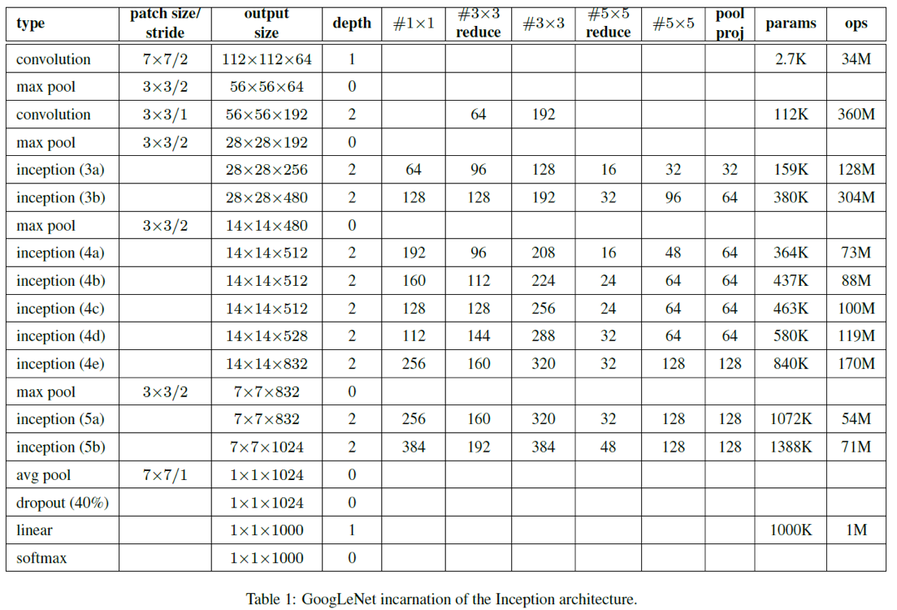
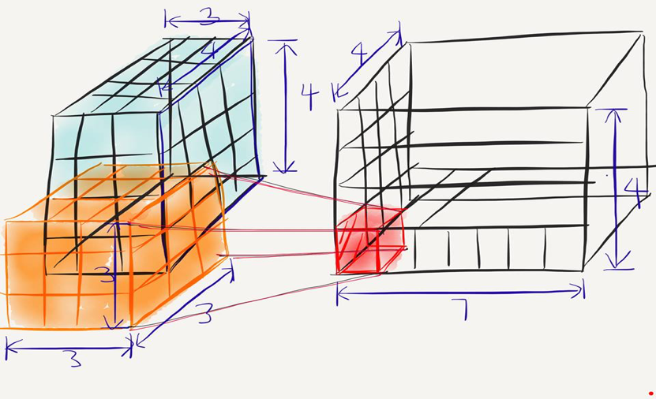
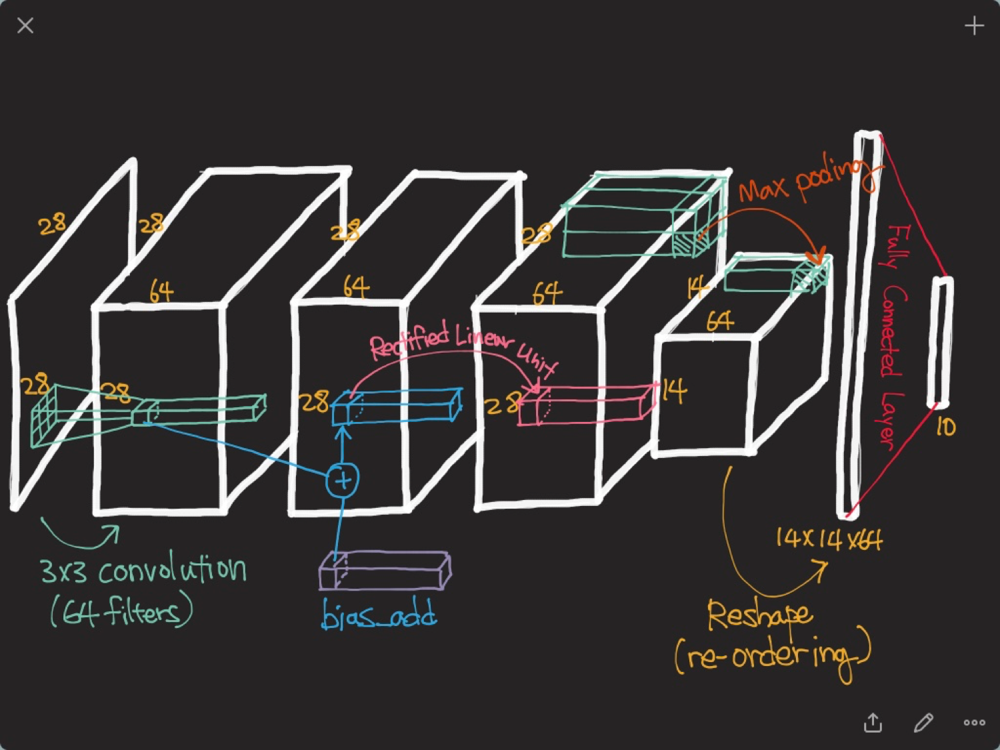

# CNN의 기초
--

## Convolutional Neural Network
- Convolutional 구조를 활용한 네트워크

- input : 입력 이미지
- Convolutions라는 연산 후, feature maps 생성
- Convolution feature map : 어떤 이미지가 주어졌을 경우 혹은 Convolution feature map이 주어졌을 때 Convolution을 한 후 얻어지는 그것을 feature map이라고 부름
- Subsampling : 이미지 안에서 더 작은 영역을 얻는 것
- Convolution + Subsampling + Full Connections(Dense Connections)

- 직관적으로 말하면 convolutions과 subsampling이 feature extraction을 해줌
- feature extraction : 이미지에서 특정 feature를 추출 (특징)
- 특징들을 가지고 fully connected layer에서 classifies(분류)

## 왜 잘될까?
- Local Invariance
	- 극소적으로 차이가 없다
	- convolution filter가 전체 이미지를 모두 돌아다니기 때문에, 우리가 찾고싶은 물체가 사진의 어디에 존재하는지는 중요하지 않음.
- Compositionality
	- 이미지가 주어지면 convolution이 찍히고 - layer - filter - convolution - layer.. 등의 계층 구조를 가짐

- convolution filter 모양과 convolution을 하는 그 위치에 있는 픽셀들이 얼마나 비슷한지를 나타냄. 비슷하면 response(feature map)에 값이 높게 나옴! 다르면 낮게 나옴 

### Architecutre

- Stride
- Zero-padding
- Channel 등의 용어에 익숙해져야 함

- Zero-padding
	- convolution을 가장자리에서 할 수 있도록 0을 넣어 padding을 줌
- Stride
	- convolution을 얼마나 건너뛸 것인지 
	- convolution의 stride size와 filter size가 같으면 오버래핑이 없음(겹치지 않음)
- batch 
	- : 이미지가 몇 장이 있는지?
 
	
### Conv2D
- input : batch, in\_height, in\_width, in\_channel
- filter : filter\_height, filter\_width, in\_channels, out\_channels

- batch=1, in\_height=4, in\_width=4, in\_channel=3(RGB)
- filter\_height=3, filter\_width=3, in\_channels=3(input의 channel과 동일해야 함), out\_channels=7(내가 가지고 있는 이미지의 서로 다른 filter의 개수)
- 파라미터의 수  => 189 = 3 * 3 * 3 * 7
- 파라미터의 수는 적으면 적을수록 좋음. 파라미터 수를 줄이면서 많은 레이어를 쌓아볼 것을 목표로!

### Example

- convolution
- bias를 더함 : 각각의 채널에 대해서 동일한 숫자를 더해주는 것
- activation function (ReLU)
- max pooling : 여러 개의 값 중에서 가장 큰 값을 꺼내서 모아둠 (평균일 경우엔 average pooling)
- 1줄로 재배열 (Reshape)
- Fully Connected Layer로 10개 숫자로 바꿈 
- 최종 10차원 벡터가 우리의 최종 출력값
- 벡터 중 가장 큰 숫자가 들어가 있는 인덱스에 있는 라벨을 사용할 것
- 파라미터의 수 
	- 3 x 3 x 64 (576) + 64(bias)
	- Fully connected layer : 14 x 14 x 64 x 10
- 요새 트렌드는 Fully connected layer를 없애던가, 간소화 하는 중
- 파라미터를 항상 생각하면, 성능을 올릴 가능성이 존재