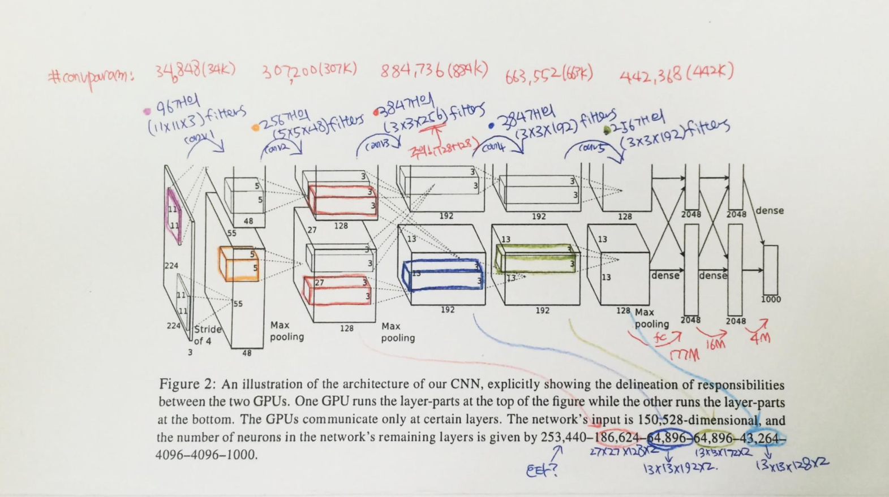
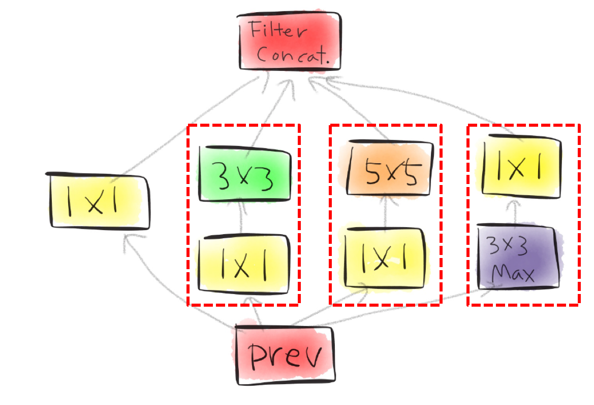
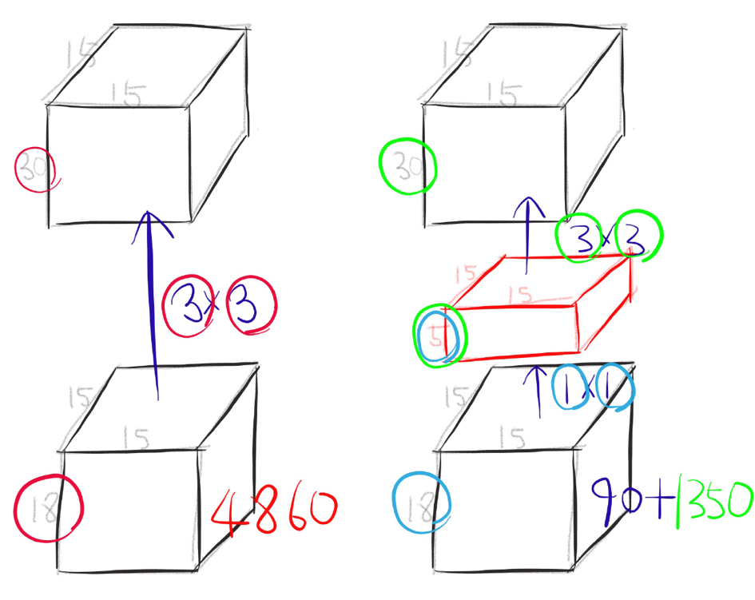

# CNN(AlexNet, VGG, GoogleNet, ResNet)

- ILSVRC 에서 우승을 했었던 CNN 구조들

- 레이어가 많다고 성능이 반드시 좋아지는 것은 아니다. 성능이 좋아질 여지가 많을 뿐!

## AlexNet
- 파라미터의 수가 몇인지 Check!
	- 11 x 11 x 3 x 48 + 48 bias
- 2 part로 나누어진 이유 : GPU 메모리가 부족했기 때문 ( 그 당시엔 좋은 GPU가 없었음 )

- 해당 논문은 딥러닝적으로 새롭다기보단 가장 기본이 되고, 초석을 닦은 논문
- ReLU ( Rectified Linear Unit )
	- 요즘은 ReLU가 분류에선 Standard지만 이 당시엔 ReLU를 많이 사용할 때가 아니었음 
- LRN ( Local Response Normalization )
	- output으로 convolution feature map이 나오면, 그 feature map 중 일정 부분만 높게 activation되도록 하는 것
	- It implements a form of lateral inhibition inspired by real neurons
- Regularizaiont in AlexNet
	- Data augmentation
		- Data를 늘리는 것
		- Flip (좌우 반전) 
		- 숫자를 분류하고 싶다면, Flip은 하면 안됩니다! (6 - 9) 찾고싶은 물체가 무엇인지 명확히 알고, 그 관련 도메인을 정확히 안 후 결정해야합니다!
		- Original Image(256x256), Smaller Patch(224x224) : 32x32x2로 2048배 이상 데이터를 늘릴 수 있음
		- Color variation : 각각의 RGB 값에 특정 값을 더함(학습 데이터에서 해당 RGB가 얼마나 변했는지를 학습으로 뽑아내고, 그것에 비례해서 더함)
	- Dropout 	
		- 이 논문에선 output을 0.5만큼 곱했음(이렇게 dropout을 한 것은 여기서 처음이자 마지막!)
		- 보통 어떤 레이어가 나오면 그 레이어의 일정 %의 노드를 0으로 만들어 주고 나머지를 사용(index는 random)
- 유일하게 사람 이름이 붙여있는 구조 

## VGG
- 파라미터의 수
	- 3 x 3 x 3 x 7
- 정말 간단한 구조
- stride 1, 3x3 convolution, maxpooling, average pooling 
- vgg-16, vgg-19를 주로 사용함
- 간단하고 직관적인 방식으로 좋은 성적을 냈음! 	

## GoogLeNet
- Google + LeNet
- ILSVRC 2014에서 1등을 한 논문
- 22 layers
- Inception Module
	- 1x1 convolution, 3x3 convolution, 5x5 convolution -> 채널 방향으로 filter concat
- Actual inception module	
	
	- 초기 module과 차이점은 1x1 convolution이 추가된 것! -> Dimension Reduction이 생겨남 ( 채널을 줄임! )
	
- One by one convolution해서 채널의 수를 줄였을 때, 이 네트워크를 정의하는 파라미터의 수가 줄어든다!!
	 
- Network in Network 구조
- 다양한 갈림길이 존재 
- Deep한 네트워크임에도 불구하고 성능을 높였음

#### Inception v4
- 파라미터를 줄이기 위해 다양한 테스트를 진행
- 1x7 conv, 7x1 conv 사용해 파라미터를 줄여보려고 노력함

## ResNet
- 152 layters network
- ILSVRC 2015 1st, ImageNet detection 1st, ImageNet localization 1st, COCO detection 1st, COCO segmentation 1st
- 이 방법론이 범용적으로 다양하게 활용될 수 있다-!!
- Deeper Network?
	- 딥한 것이 가장 좋은가?라는 문제제기로 시작
	- 좋은 initialization(초기 weight 설정)을 하고, batch normalization / ReLU를 통해 상대적으로 Vanish Problem이 덜 중요하다고 말했음
	- Overfitting이 문제인가? No!
		- Overfitting을 알아보는 방법 : training error가 줄어들고 training accuracy가 좋아지는데 test accuracy가 올라가다 떨어지는 경우!
		- Train Data를 너무 잘 맞추려는 나머지 Test Data를 못맞춤. Train Accuracy와 Test Accuracy가 서로 상반되는 결과를 나타내면 Overfitting이라고 생각하고 Early Stopping! 
	- Degradation Problem이 문제!
		- Train, Test도 잘 되는데 성능이 잘 안나온다!
- Residual learning building block
	- 어떤 입력이 들어오고, 출력이 나오면 그 입력을 출력에 더함! (입력과 출력의 dimension이 같아야 함!)
	- 중간에 있는 레이어는 input과 output의 차이만 학습!
	- 더 잘될거라고 가정한 후 해보니 잘되고 쉽다!
	- 단점 : 같은 dimension을 사용해야 한다! dimension을 맞추기 위한 네트워크를 추가해야 하는 경우가 존재
