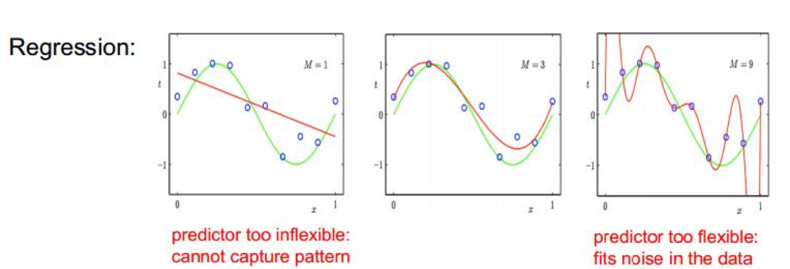
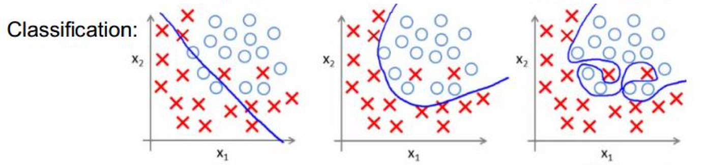
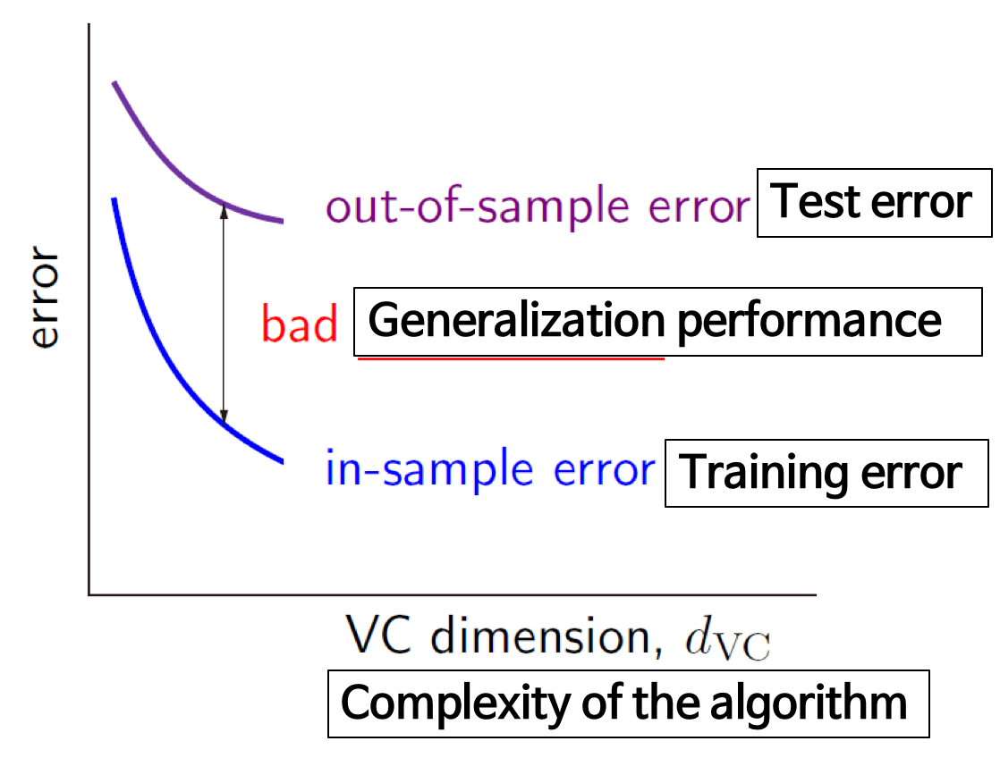
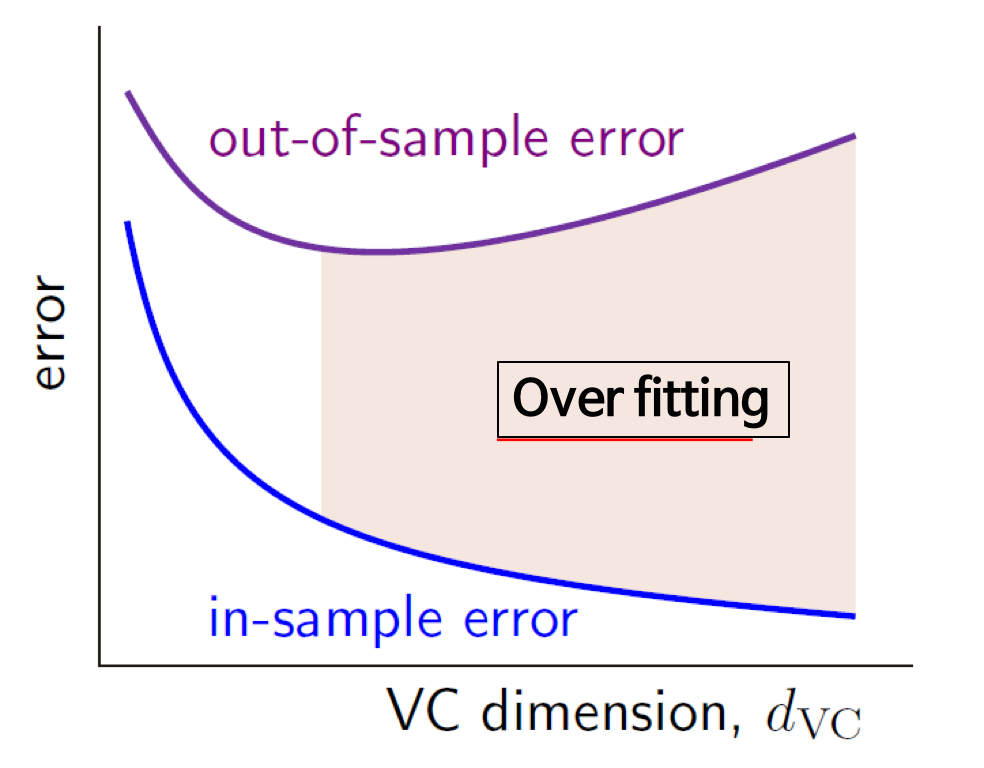
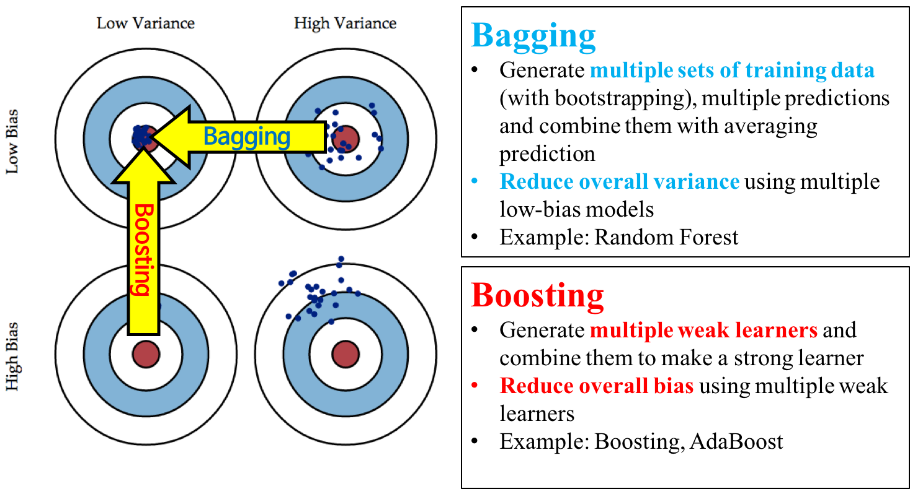

# 04. Regularization
- 딥러닝 특화가 아닌 머신러닝 전반적에 해당하는 내용
- 여기 나오는 테크닉을 반드시 익혀야 함!!
- [deeplearning book](http://www.deeplearningbook.org/contents/regularization.html) 에 대한 내용도 읽어보면 좋습니다

## Regularization
- Main Purpose : To avoid Overfitting

## OverFitting
- 학습 데이터를 너무 믿는 나머지 테스트 데이터를 못맞춤

- 회귀 문제의 경우 이렇게 표현됨. 초록색은 이상적인 함수
- 학습 데이터를 너무 잘 맞추는 것이 최선은 아님

- underline function이 초록색처럼 생겼다고 알고 있었기에 빨간색 선을 overfit이라고 함. 하지만 underline function을 거의 알 수 없음.
- train error가 줄어든다고 무조건 안좋은 것은 아님. 
- train error는 줄어들면서 test error가 커질 때가 문제!!
- proxy ( train_error - test_error )을 통해 간접적으로 overfitting을 알 수 있음
- N차 함수를 사용할수록 점점 더 안좋아질 확률이 큼!! ( 더 Deep 해지는 것 )

### OverFitting의 원인
- Stochastic Noise : random measurement error
- can not model deterministic noise
- 원래 시그널을 완전히 복구하는 것은 불가능하다고 보면 됨

- VC dimension : 함수의 복잡도 (뉴럴넷의 레이어 수)
- in-sample error : Training error
- out-of-sample error : Test error
- bad : Generalization performance
- 머신러닝의 목적 : Generalization Peroformance가 높아지는 것!! (= Train 데이터로 Test 데이터를 잘 맞추는 것)

- 점점 커지는 부분이 Over fitting
- x축이 VC dimension!

### Overfitting을 막는 방법
1. 많은 데이터를 수집한다
	- 제일 중요!!!! 데이터가 없다면 Data Augmentation을 통해 데이터를 뻥튀기 시켜줘야함 
2. 적절한 capacity(능력)을 갖는 모델을 활용 : 레이어의 개수를 늘려보고 줄여보고 바꿔가면서 test (데이터가 많다면 상관 없음)
3. Average many difference models (앙상블)
	- 데이터셋이 만개 있다면 8천개씩 뽑아서 5개의 데이터셋을 만든 후 각각의 모델을 8천개의 데이터로 학습시킴! 입력이 있다면 5개의 결과가 나타남. 그 후, 가장 많이 가르키는 값을 사용! 
	- 대부분 캐글의 리더보드엔 앙상블을 사용
4. Dropout, DropConnect, BatchNorm같은 테크닉 사용

### Limiting the Capacity
- 네트워크 사이즈를 줄임
- Early stopping 
	- validation error가 줄어들다가 다시 커지기 시작하면 Stop!
- Weight-decay 
	- 학습하는 파라미터를 크게 안하는 패널티를 추가 (L1, L2)
- DropOut 
	- 한 레이어가 있을 때, 몇개의 노드를 꺼버림 (학습할 때만) 테스트할 경우엔 모두 사용!
- DropConnect
	- 레이어(노드)의 값을 0으로 만드는 것이 DropOut이고 Weight를 끊어버림(0으로 바꿈)
- Batch Normalization
	- 제일 중요함!! 대부분의 문제에서 사용하면 됨
	- 평균을 빼고 variance로 나눠줌
- Benefits of BN
	- Learning rate을 늘려도 됨
	- dropout을 사용하지 않아도 됨
	- L2 weight decay를 사용하지 않아도 됨
	- Learning rate decay를 더 빠르게 가능
	- LRN을 사용하지 않아도 된다
- Overfitting은 언제나 발생한다!!! -> Regularization을 항상 생각하기!
- 감이 중요함. 어떤 것이 좋은지는 정말 모두의 케이스마다 다름!!!!! 인내심을 가지고 천천히 계속 진행해보는 것이 좋음

## Book review
1. Parameter Norm Penalties
	- L2 weight decay(제곱값)
	- L1 weight decay(절대값)
2. Dataset Augmentation
	- 기계 학습 모델에서 데이터를 많이 모으는 것이 중요!
	- 데이터가 없다면 fake data를 만들어서 학습 데이터를 늘리자
	- Label preserving transformation
	- noise를 집어넣는 것
	- subsampling
3. Noise Robustness
	- 레이어가 여러개 있을 경우 레이어 중간 중간에 노이즈를 집어넣는 것이 L2 weight decay보다 더 강력할 수 있다
	- 뉴럴넷의 Weight에도 Noise를 넣어줌
	- Label-smoothing : classification할 경우 0 / 1이 아니라 0.2 / 0.8 등으로 smooth하게 만듬
4. Semi-Supervised Learning
	- Supervised Learning + Unsupervised Learning
	- Convolution 레이어를 정의할 때, Unsupervised 데이터를 가지고 pretrain을 시키면 Unsupervised label에 적합한 representation이 될 수 있음
	- AutoEncoder
5. Multi-Task Learning
	- 한번에 여러 문제를 푸는 것. 사람의 얼굴로 남녀 구분, 나이 구분 등등 다른 output을 찾음
	- 이 구조는 shared를 갖는데, 이 shared가 representation을 잘 찾아줌
	- 서로 다른 문제(task)중에서 몇가지는 공통된 무언가가 존재함!
	- 문장이 들어가면 번역도 하고, 감정 분석도 해서 성능이 좋게 만들고 있음
6. Early Stoping
	- train set error는 감소될 때, validation error가 올라갈 때 Stop
7. Parameter Tying and Parameter Sharing
	- 파라미터를 묶어서 수를 줄여줌
	- Parameter Tying
		- 입력이 다른데 같은 task를 수행하는 것들을 특정 레이어를 공유하던가 2개의 weight를 비슷하게 만듬!
	- Parameter Sharing
		- CNN
8. Sparse Representation
	- 어떤 output이 나올 때, 그것들의 대부분이 0이 되는 것
	- Sparse weights
		- 네트워크의 weight에 0이 많음
	- Sparse activations
		- 뒷단의 activation에 0이 많음
		- ReLU
9. Bagging and Other Ensemble Methods

	- Bias가 높다 : 틀린 것 (평균에서 멀어짐)
	- Variance가 높다 : 할때마다 값이 달라짐
	- Low Bias, Low Variance를 원함
	- Bagging : 여러 값을 평균
	- Boosting : 시콘셜하게 차이를 계산해서 하나씩 더해감 (AdaBoost)
10. Dropout
	- 노드를 끊음
11. Adversarial Training
	- 사람이 이해할 수 없는 noise를 넣고 테스트를 하면 완전 다른 class가 나옴..!
	- 딥러닝 모델의 기울기가 엄청 가파르다 (작은 파라미터값이 변해도 크게 결과값이 달라짐)