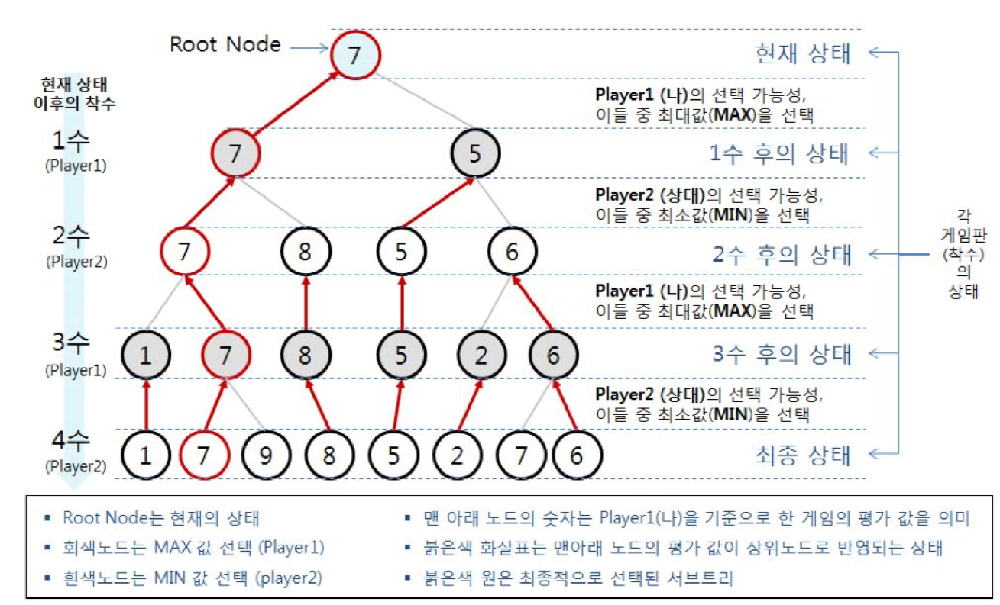
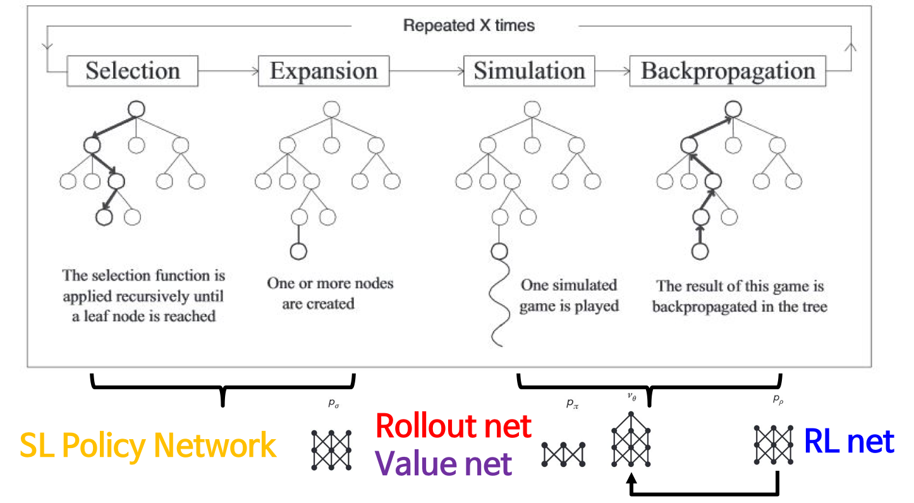
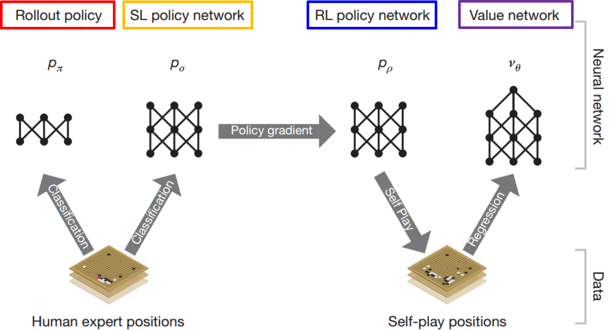
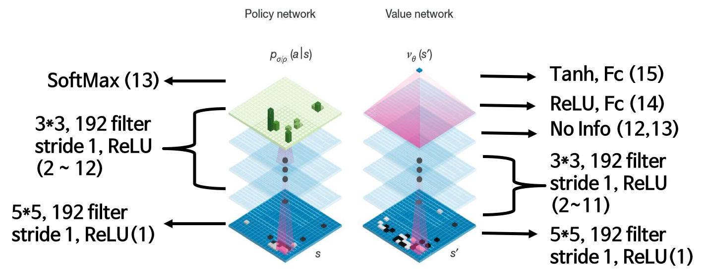
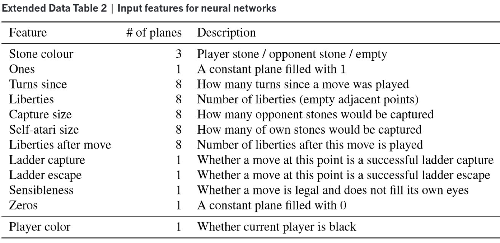
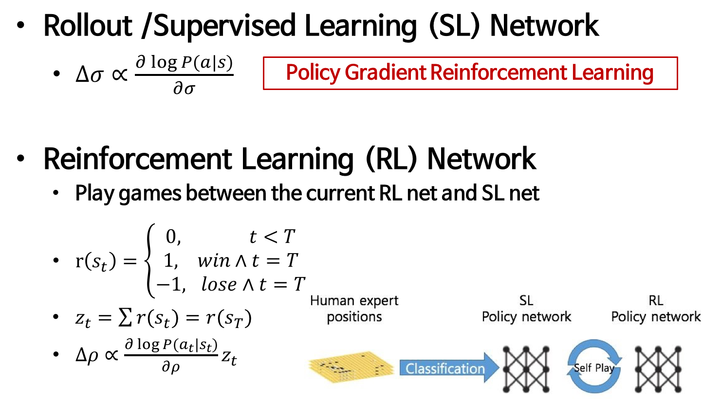
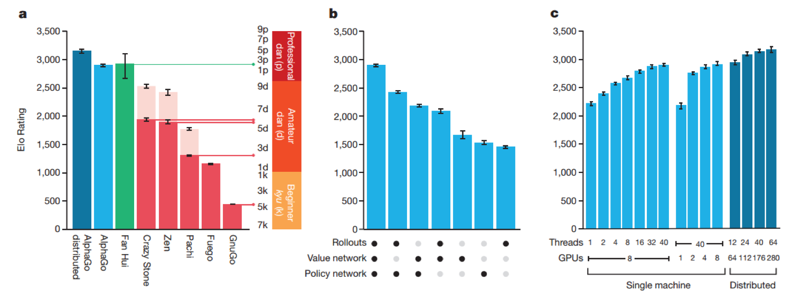

# Nature 논문으로 살펴보는 AlphaGo 알고리즘

- DeepMind
- 알파고에 들어가 있는 가장 기본적인 알고리즘은 MCTS!
- 의의 : 기존에 있던 방법론에 딥러닝이 가지는 중요한 특징(정말 많은 데이터셋을 고려할 수 있다)을 적용!

### Complexity of Go
- 19x19
- 자신의 돌이 타인의 돌 안에 있으면 안됨
- 자신의 집 안에 공간이 얼마나 있는지로 점수 측정
- 체스와 다르게 더 많은 복잡도를 가짐 ( 체스 : 10^123 )
- 바둑 : 10^360

### Monte-Carlo Tree Searh

- 나와 상대방이 번갈아가면서 수를 놓음
- 트리처럼 뻗어나감 
- 상대방이 제일 둘 것 같은 수에 둬야 Search가 가능!
- 4가지 스텝이 반복 ( Selection - Expansion - Simulation - Backpropagation )

- Selection : 리프 노드가 될때까지 계속 Selection (Recursively)
- Expansion : 다음번 노드로 늘려보는 것
- Simulation : 게임이 끝날때까지 시뮬레이션이 돌아감
- Backpropagation : 그 결과가 얼마나 좋은 수였는지를 파악
- 각각의 rule이 존재

### Training Networks
#### MCTS in AlphaGo

- Rollout policy, SL policy network : 사람의 기보를 토대로 학습해 분류 문제를 풀었음
	- Rollout policy : Shallow. 빠르게 봐야하는 경우
	- SL policy network : Deep. 한수 한수 볼 경우
	- Expansion에 활용 (번갈아 두면서 둔 것을 학습하니깐!)
- RL policy network : 사람이 둔 것 + 알파고끼리 뒀을때 끼리의 수를 가지고 학습
	- policy network의 공통점: 현재 판이 돌아오면 어디다가 다음 바둑알을 둬야 하는지를 찾음
	- Value Network를 학습할 때만 활용
- Value network : 현재 판세를 평가하는 네트워크
	- 알파고가 생각하는 좋은 판세를 계산

- Value network의 마지막 activation은 Tanh!(-1 ~ 1로 정규화)

- Input Features를 가지고 Depth를 만듬
- Filter의 개수에 따라 성능이 달라졌음!

### Searching with policy and value networks

- RL policy network는 알파고끼리 둔 기보도 고려해야 했습니다
- Policy Gradient Reinforcement Learning을 사용!
- 이긴 판에 대해선 reward를 1, 진 판은 -1을 줌
- Value Network
	- 사람의 기보만으로 진행하면 over-fitted
	- 따라서 RL polciy network를 통해 학습된 데이터를 사용  
- Distributed AlphaGo의 성능이 좋음(더 많은 Search)
- For policy networks, predictions were averaged with 100 rollouts 

### Experiments
- Selection Rule
	- Q값 : State가 주어졌을 때, 다음에 어디를 둘지 예측하는 것
	- u : 어떤 policy function이 있고, 그것의 N_r(몇번 들어왔는지) 
	- 독립적으로 돌아가는 cpu가 동일할 수를 보면 많은 것을 커버할 수 없음. 그것을 위해 이 Rule을 추가
- Expansion Rule
	- 너무 많이 visit count를 넘으면, 다음 state가 search tree에 추가되서 그 tree로부터 expansion
- edge
	- N_v(s,a), N_r(s,a) : 몇번 체크를 했는지	
	- W_v(s,a), N_r(s,a) : 이겼는지 졌는지
	

### Result

- Distributed을 사용한 것이 성능이 더 좋음!