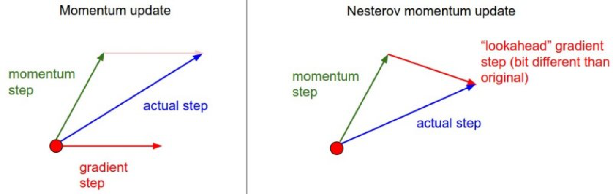
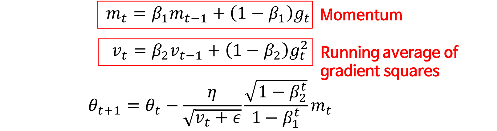
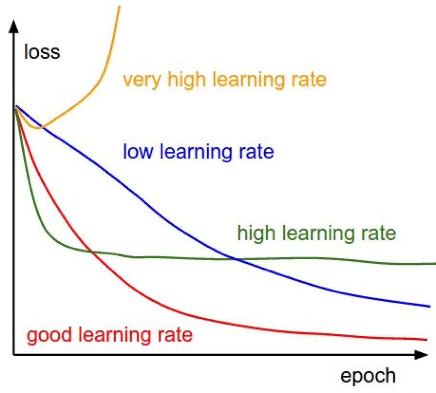

# 08. Optimization 방법론
- 뉴럴넷을 학습시킬 때(=training) 사용하는 Optimizer가 어떤 것이 있고 각각의 특징과 시간순으로 어떻게 발전했는지 볼 것입니다
- 그냥 사용하는 경우엔 몰라도 되지 않나? 이런 생각과 함께 넘어갈 수 있지만, 굉장히 실용적인 부분!!

## Gradient Descent
- 항상 가정하고 있는 것 : Gradient Descent
- 특정 함수가 있으면, 그 함수의 최저점을 찾고 싶어요. 그 함수들은 도메인이 어디일까요? 함수가 살고있는 공간은 파라미터들입니다. 파라미터가 1개면 1차원 그래프를 그려볼 수 있고, 2개면 2차원 공간에서 그래프를 그려볼 수 있습니다!
- 그러나 1억차원이라면? 어떻게 생긴지 몰라서 그리기 어려움
- 우리의 가정 : **파라미터가 어떻게 생긴지는 모르지만, 이것들의 기울기만 알고 있다!**
- Gradient : 1차 미분
- Hessian : 2차 미분(기울기의 기울기). ex) newton method
	- 어떤 위치에서 기울기를 찾을 때(=혹은 이 위치에서 최소로 가는 점을 찾을 때) 단순히 기울기만큼 옮기는 것이 아니라 기울기만큼 2차 근사를 수행! 근사를 한 위치로 파라미터를 뿅! 하고 옮김
	- 파라미터가 100개면 Gradient의 Dimension은 100! Hessian은 100x100 Dimension을 가져서 2차 근사를 하기 어려운 점이 있습니다
	
### Batch Gradient Descent
- 전체 Train 데이터를 한번에 고려해 Gradient Descent를 구하는 것
- 오래 걸림

### Stochastic Gradient Descent
- 한번에 1개만 고려해 Gradient Descent를 구하는 것
- 떨림 양상이 생김(우리가 하고 싶은 것은 모두가 최소점을 갖는 곳을 찾고 싶은데 Stochastic은 1번에 1개만 봄. 1개를 바꿨더니, 나머지에겐 모두 나쁠 수 있음)
- 이렇게 구한 Gradient의 Expectation이 원래 Batch Gradient Descent와 같아서 Stochastic이라 부름

### Mini Batch Gradient Descent
- 위 2가지 방법의 중간 단계. Mini Batch Size만큼 고려
- 미니배치 사이즈는 64, 128, 256 같은 2^n 단위로 감
- GPU를 사용할 경우엔 GPU에 메모리를 올려di 하는데, GPU에 메모리를 할당하는 단위가 2^n라 미니배치 사이즈도 2^n
- Rule OF THUMB
- 일반적으로 통용되고 있는 사실 : Mini Batch Size가 작을수록 성능이 왠만하면 좋음(그러나 시간이 오래 걸림)

## 문제점
- Learning Rate를 잡는 것이 어려움. 우리는 방향만 알고 있음! 
	- 구간을 모두 Search하는 경우가 있는데, 우리는 그렇제 하지 않고 learning rate를 하나 정하고 Gradient가 나오면 그만큼 파라미터를 업데이트!
	- Learning rate schedule
- Local minima로 빠질 수 있음
	- 초기값을 잘못주면 학습이 잘 안되고, learning rate를 너무 크게주면 학습이 안되고, learning rate를 너무 낮게주면 시간이 오래 걸림

### Momentum 
- 한쪽방향으론 값이 계속 커지는데, 특정 부분은 진동하는 경우 사용
- 이전에 얻어진 gradient와 새로 얻어진 gradient를 더해 값을 얻음
- Local minima에 빠지는 경우 잘 빠져나오질 못함

### Nesterov accelerated gradient

- gradient를 momentum 방향만큼 옮긴 다음, 그 위치에서 gradient를 계산
- 진동하는 경우 좋음

- 위 2개는 Momentum 방법론 : 이전 gradient를 활용해 지금 gradient update에 활용!

### Adagrad

- 모든 파라미터마다 learning rate를 바꿔주는 것!
- 10,000개의 파라미터, 1개의 learning rate만 가지고 있는 경우 컨트롤할 수 있는 것이 많이 없음.
- 따라서 여기선 각각 파라미터마다 learning rate를 바꿔주는 것
- 가정 : **많이 변했던 파라미터는 조금 변하게 하고, 조금 변했던 파라미터는 많이 변하게 함**
- 치명적인 단점 : G가 계속 변함(제곱값이라 작아질 수가 없음) -> learning rate는 계속 줄어듬 -> 해당 네트워크는 학습이 되지 않음

### Adadelta

- learning rate가 계속 줄어드는 것을 막기 위해서 Exponential Moving Average를 계속 업데이트해줌(스케쥴링)
- 파라미터가 변한 양도 같이 트래킹해서 계산에 쓰임
- 엡실론 : 초기에 이 값이 너무 커지면(0으로 나누면 무한대) 안되기에 들어가 있음
- learning rate가 없이 구현

### RMSprop

- Exponential Moving Average를 분모에 넣고 update

### Adam

- Adaptive Moment Estimation
- Learning rate + Momentum
- 파라미터가 1개 늘었음 
- b1 : gradient, momentum을 구할 때 얼마나 exponential할지
- b2 : adaptive learning rate를 위해서 gradient의 제곱을 exponential moving average를 얼마나 할지
- v_t : 지금까지 gradient가 얼마나 변했는지
- 아래 식에서 gradient가 들어갈 자리에 momentum이 들어가 있음! 
- 루트(1-b_2^t)/(1-b_1^t) : gradient가 원래 gradient 대비 unbias estimator를 위해 보정
- 실제로 중요한 파라미터 
	- b_1 : 원래 momentum의 파라미터
	- 입실론 : 초창기 gradient 제곱에 대한 exponential moving average가 0이기 때문에 0으로 나눴을 때 문제가 되는 것을 막기 위한 것
	- 보정하는 것이 아니냐?라는 말이 있을 수 있는데, 직관적으로 생각하면 gradient의 제곱이 처음에 너무 작음. 그러면 초창기에 얻어지는 gradient가 굉장히 큰 영향을 미침. 
	- exponential이 작다는 것은 v가 조금만 작아져도 (최근에 gradient가 조금만 안들어와서 그게 너무 작아지면) 그 방향으로 파라미터를 확 밀어버림 => 학습이 불안정해짐
	- 초기 파라미터가 1e-08(굉장히 작음) 학습이 안될땐 이 값을 바꾸는 것을 추천!(조금 크게..! 회귀 문제에선 초기값보다 크게 해주는 것이 좋았다고 합니다!)
	- 현존하는 끝판왕. 왠만하면 Adam을 사용!
	- Momentum을 사용하고 싶다 -> Adam
	- 이전 gradient가 중요하지 않을 것 같다 -> RMSprop

- 보면 Adaptive 시리즈가 local minima에서 빨리 벗어남	

## 어떤 Optimizer를 사용할 것인가
- Adaptive 시리즈를 사용하는 것이 좋음 (Adagrad, Adadelta, RMSprop, Adam)
- Stochastic Gradient Descent나 mometum은 왠만하면 안쓰는 것이 좋습니다	
- Adagrad는 learning rate가 계속 줄어드는 효과가 있어서 RMSprop이 발전시켰음(Adadelta도 마찬가지)
- Adam은 bias-correction과 momentum을 RMSprop에 넣음

## 추가적인 방법론
- 그렇게까지 좋은 방법론은 많이 없음

### Shuffling 
- 학습 데이터는 매번(매 epoch마다) 섞어주는 것이 좋아요

### Curriculum Learning
- 쉬운 것부터 학습하고 점점 어려운 것을 학습시킴(난이도는 갖춰가서 사람이 중고등 과정을 밟듯!)

### Batch Normalization
- 매우매우 중요!

### Early stopping
- 이것도 매우 중요
- validation accuracy가 떨어지면 학습을 멈춤

### Gradient noise
- 우리가 얻어지는 gradient에 noise를 조금 넣고 학습시키면 학습이 조금 빨라짐

## 결론

- 우리가 원하는 것은 빨간색 선
- 초록색 -> high learning rate -> lr을 낮춰보기
- 파란색 -> linear : 학습을 멈추고 lr을 키우기
- 노란색 -> 튀기 시작하면 lr을 낮춰보기
- 결론은 문제마다 다름!!
- 내 loss가 오랜 시간동안 바라볼 때, linear하면 멈추기!!! 학습이 좀 되다가 튀면 거의 learning rate가 너무 커서 그러니 조금 줄여보고, Adam을 사용하고 있다면 엡실론 파라미터를 조금 키워보길