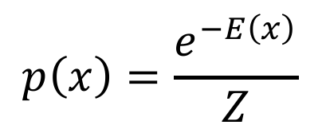
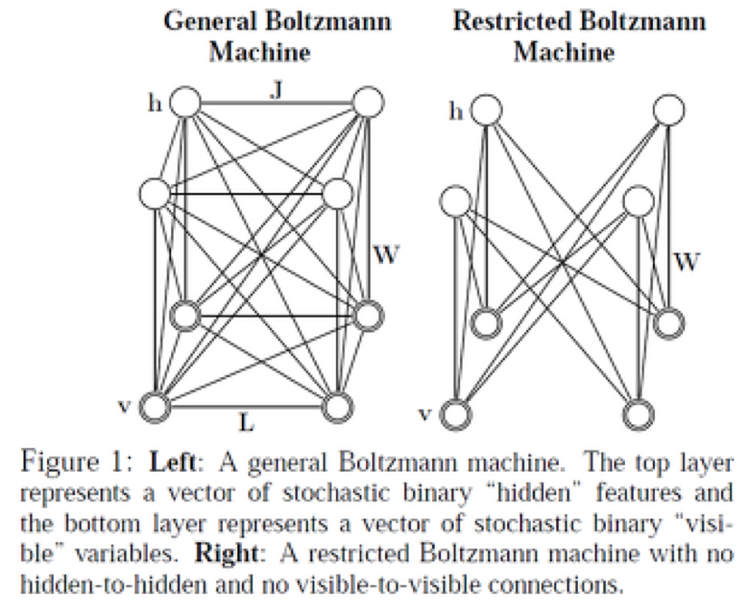
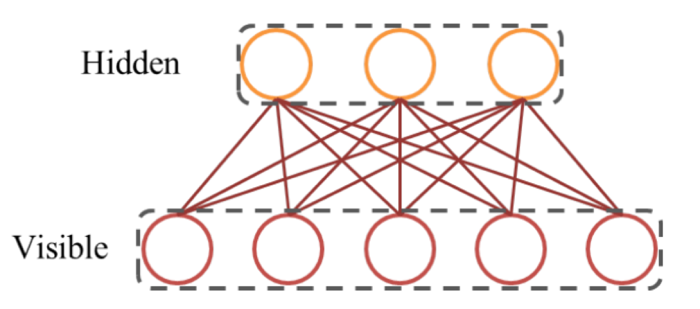
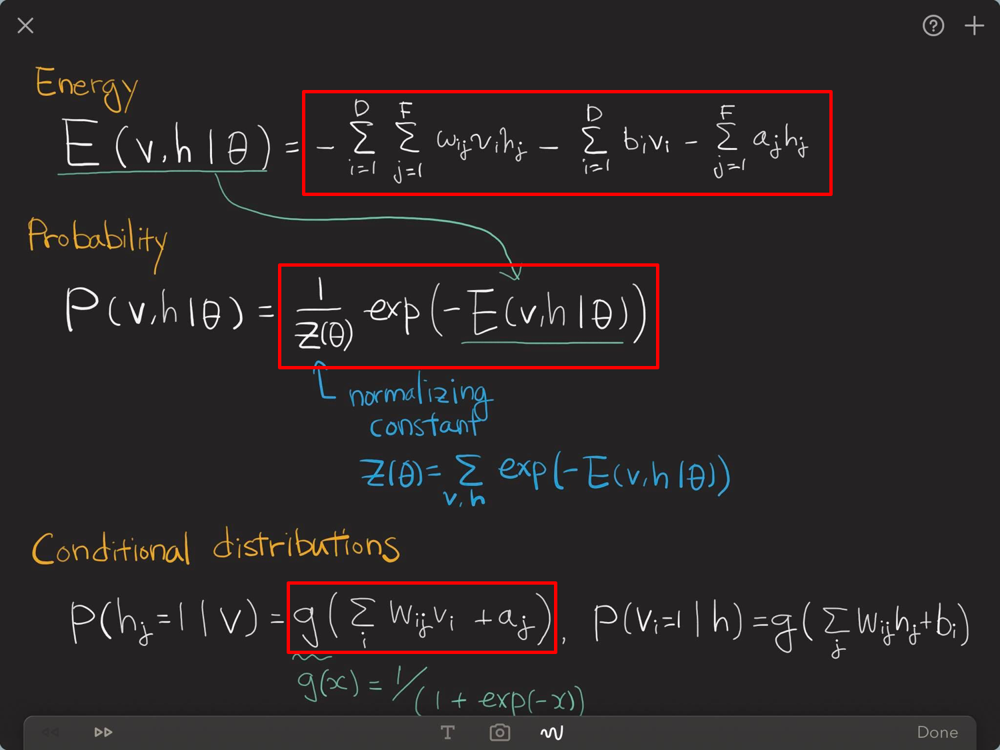
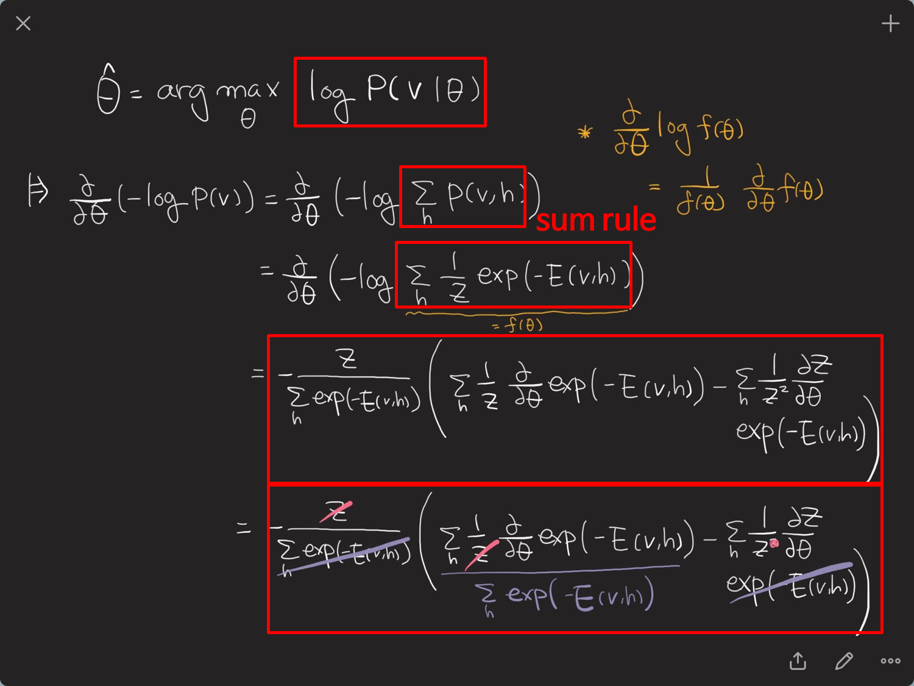
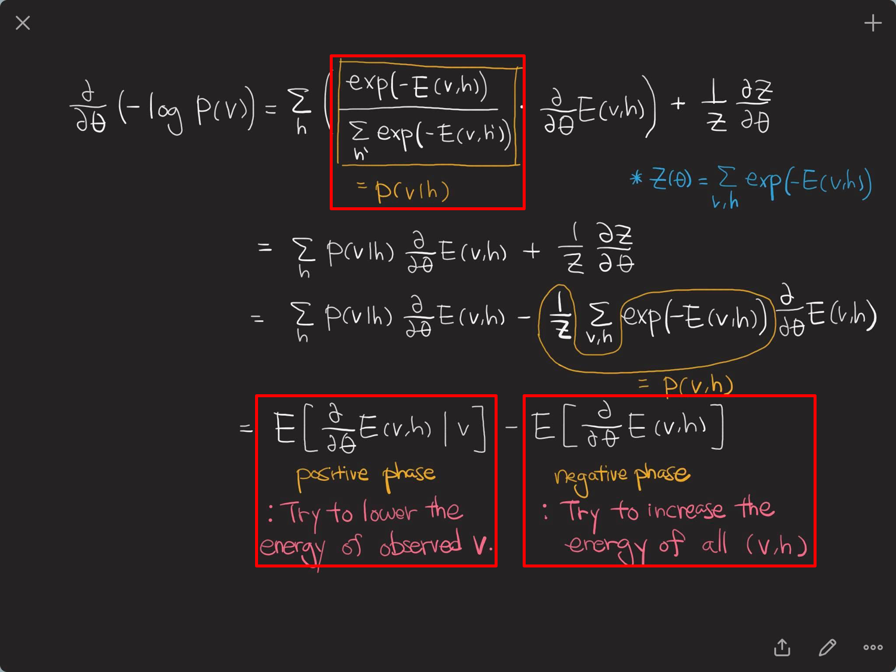
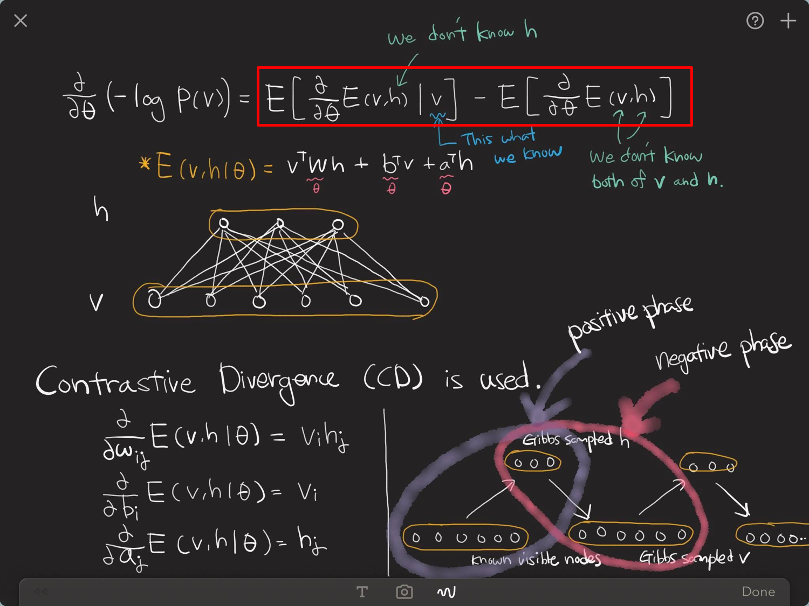

# 09. Retricted Boltzmann Machine(RBM)
- 대부분 딥러닝하면 input -> output으로 연결되는 supervised learning으로 많이 떠올리지만 이 장에선 Unsupervied Learning을 익혀볼 예정입니다
- 수학이 좀 많이 들어가는데, 인내심을 갖고 관심이 있다면 관련 수식을 유도해보는 것도 좋을 것 같습니다
- 대표적인 Unsupervised Learning로, 딥러닝이 살아날 수 있도록 해준 불씨

## Energy-based models

- x : 일종의 이미지
- 그 입력이 있을 확률은 Energy에 반비례
- 에너지를 찾으면 됩니다! 이 에너지를 학습하는 것이 우리의 목적입니다
- 어떤 기체가 그 공간에 온도로 있을 확률은 온도에서 나온 에너지에 반비례합니다 -> 이런 것이 모두 Boltzmann으로 해석이 가능

## Boltzmann machine

- 모든 노드들이 다 연결되어 있음
- v : visible(우리가 가지고 있는 이미지)
- h : hidden
- 우리가 다뤄볼 RBM은 hidden과 visible(=노드끼리는, 레이어 안에서는) 커넥션이 없고 레이어 사이에 커넥션이 있음
- 이것이 마치 NN와 같음
- Boltzmann machine은 기본적으로 각각의 원소들이 0 또는 1을 가지고 있다고 가정(확률적으로) -> 일종의 stochastic network로 볼 수 있음
- RBM은 visible 노드끼리의 커넥션, hidden 노드끼리의 커넥션을 끊어버리고 visible-hidden 사이의 노드의 커넥션은 살아있음

- NN와 동일!
- NN을 학습시킬 때, Pretrain로 활용! 
	- 이미지만 가지고 RBM으로 네트워크의 길을 닦아놓고 그것을 초기값으로 해서 NN을 학습하면 성능이 잘나옴!

- RBM은 enery-based model이기 때문에 energy를 정의하면 끝남!
- 결국 RBM을 학습하는 것은 RBM에 들어가는 에너지를 학습하는 것을 의미합니다
- 에너지의 Goal을 정해둠. w_ig, b_i, a_j가 우리의 weight!
- 에너지가 주어지면 확률을 정의할 수 있습니다. 이 때 문제가 되는 것은 normalizing constant가 문제가 됩니다. 

### normalizing constant

- 모든 가능한 hidden과 visible 노드에 대해서 expectation을 해서 sum
- 이것을 개선한다는 것은 모든 visible과 hidden값을 모두 집어넣어 summation을 한다는 것을 뜻합니다
- 만약 visible, hidden이 각각 100개가 있다고 하면 이 상태에서 z를 구해야 합니다. 가능한 콤비네이션은 2^200만큼 sum을 해야 1번 계산 가능..! 계산량이 많아요

- joint distribution : p(x,y) = p(x|y) = p(x,y)/sum p(x,y)
- join distribution을 이용해 conditional distribution을 유도할 수 있음!

- 우리의 목적 : 어떤 visible이 주어졌을 때, 그 visible을 최대로 하는 파라미터를 찾는 것 (파라미터 = 에너지를 정의하는 w, b, a)
- cost function의 gradient를 구하듯 -logp의 gradient를 구해봅시다!

- energy function 미분한 것과 hidden, visible이 모두 주어진 경우의 energy function 미분한 것 2개의 term이 있습니다
- positive phase : 어떠한 visible이 주어졌을 때, 모든 가능한 hidden으로 sum => 2^100
- negative phase : 모든 가능한 visible, hidden으로 sum => 2^200

- visible이 주어졌을 때 hidden을 집어넣어서 구하는 것은 어렵기 때문에, visible이 주어졌을 때 hidden에 대한 conditional distribution에서 샘플링!!!
- known visible nodes로 부터 hidden을 샘플링! (한쌍이 생겼으니 positive phase를 계산 가능)
- 샘플링된 hidden으로부터 다시 visible을 샘플링해서 negative phase를 계산
- 이렇게 계산하는 방법론을 Contrastive Divergence(CD)라고 부릅니다. 통계학에서 말하는 Gibbs 샘플링과 동일!

## Deep Belief Network (DBN)
- RBM을 쌓는 것
- 2014년까지 뜨다가 요새는 잘 사용되지 않음
- [최성준님 블로그](http://enginius.tistory.com/315)
- 최성준님 첫 논문이 DBN을 사용한 것!

## 참고자료
- [초보자용 RBM](https://deeplearning4j.org/kr/restrictedboltzmannmachine)
- [깁스 샘플링 포스팅](https://ratsgo.github.io/statistics/2017/05/31/gibbs/)
 