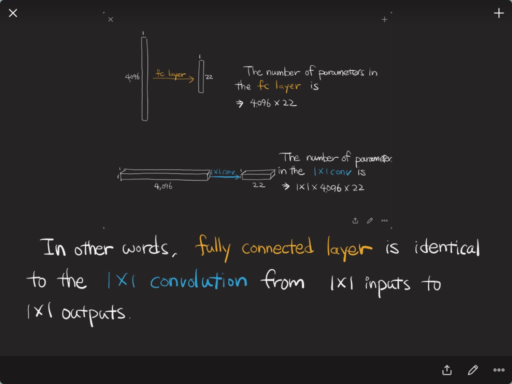

# 이미지의 각 픽셀을 분류하는 Semantic Segmentation

- 이미지가 주어졌을 때, 이미지에 있는 각 픽셀별로 그 픽셀들이 뭐에 속하는지 픽셀에 대한 분류를 푸는 것!
- 앞에서 봤던 로지스틱 리그레션, MLP들의 목적은 하나의 이미지를 분류하는 one hot 벡터를 찾는것! 클래스의 개수가 10개면 벡터의 길이가 10이 되는 어떤 벡터를 찾는 것이 목적이었습니다
- Semantic Segmentation은 모든 픽셀마다 진행! 어떤 이미지가 들어왔을 때(100x100) 100x100 이미지에 대한 one hot 벡터의 길이는 클래스의 길이인데 이것을 모든 픽셀마다 다 하는 것
- 100x100x3 채널이 들어왔을 때, 100x100xclass개수만큼을 뱉어내는 뉴럴네트워크 (채널이 클래스의 개수) 
- 이번 강의에선 4가지 논문을 볼 예정

## 적용
- 자율 주행
	- 내 앞에있는 영역이 사람인지, 도로인지, 인도인지, 벽인지, 하늘인지가 정말 중요. 
	- 테슬라의 사고 : 흰 트레일러 부분을 하늘이라고 파악해서 지나가도 된다 -> 앞으로 가다가 트레일러 밑으로 들어가 사람이 죽음.. 

## [Fully Convolutional Networks for Semantic Segmentation](https://github.com/sjchoi86/dl_tutorials_10weeks/blob/master/papers/Fully%20Convolutional%20Networks%20for%20Semantic%20Segmentation.pdf)
- 딥러닝을 이용해 Semantic Segmentation을 할 수 있다는 지평을 열었던 논문. 보통 Deconvolution 논문이라고 하면 이 논문을 가리킴
- Fully Convolutional Network (FCN)

	- 뒷단에 Fully connect layer가 없고 모든 네트워크가 convolution으로만 이루어져 있음
	- input size에 의존적이지 않음(일반적으로 convolution을 했을 때 input size가 커지면 그와 비례해서 output size가 커짐!)
	- Fully Connected로 만든 것을 90도로 돌려서 1x1xdimension짜리 convolution layer로 바꾼 것!!!
	- Convolutionalization라고도 불립니다
	- 입력 이미지의 사이즈가 커질 때 큰 효과를 발휘함!!

	- 이미지 안에서 분류하는 문제에서 더 큰 이미지가 들어오면 지금 물체가 이미지의 영역에 대충 어디에 있는지 히트맵이 나타남!
	- Convolution을 하면 output의 input보다 사이즈가 작아지기 때문에 그것을 복구하려고 함
	

- Deconvolution
	- interpolation하기 위해 사용
	- stride=2인 상태 => convolution시 입력 이미지의 width, height이 절반으로 줄어듬
	- 어느 한 숫자에 convolution filter만큼의 값을 곱함
- Fully Convolution Network + Deconvolution를 키워감
- 단 Deconvolution시 Skip connection을 사용! (1/32까지 이미지가 줄어든다면 키워도 복원이 안되기 때문에, 1/8까지 줄인 것을 8배 늘리고, 1/16까지 줄인 것을 16배 늘리고, 1/32까지 줄인 것을 32배 늘리고 합치는 방식)
- End to End 방법론

## [Semantic Image Segmentation with Deep Convolutional Nets and Fully Connected CRFs](https://github.com/sjchoi86/dl_tutorials_10weeks/blob/master/papers/Semantic%20Image%20Segmentation%20with%20Deep%20Convolutional%20Nets%20and%20Fully%20Connected%20CRFs%20%20.pdf)
### 문제 제기
- Signal downsampling
	- 줄어든 정보로 복원해도 잘 안된다! 
- Spatial insensitivity
	- 윤곽선을 잘 못따는 문제 -> Conditional random field라는 후처리 방법론을 사용
	- 이 방법론은 딥러닝과 상관없는 알고리즘으로 signal downsampling 문제를 해결하기 위해 나옴

	
### atrous convolution
- 입력 image 사이즈에 비해 dense한 feature map을 만들고 싶음
- 우리가 convolution을 할 때, input 이미지에 비해 output 사이즈는 줄어듬(stride=2일 경우)
- 그런데 만약 input이 3개인데 output이 5개인 것을 만들고 싶다면?
- atrous convolution라고 중간에 0을 rate만큼 집어넣어 convoltion을 더 dense하게 만듬
- 장점 : 3x3 filter 9개의 파라미터만 가지고도 5x5 receptive field를 얻을 수 있음
- 참고 : [라온피플 블로그](https://m.blog.naver.com/PostView.nhn?blogId=laonple&logNo=221000648527&proxyReferer=https%3A%2F%2Fwww.google.co.kr%2F)
- rate : convolution의 간격을 얼마나 더 벌릴지는 정하는 파라미터

### conditional random field
- atrous convolution을 사용해도 중간에 max pooling이 있기 때문에 기존보다 작은 output이 나옴 -> 이것을 늘리기 위해 후처리 하는 방법론이 conditional random field
- 각 픽셀마다 라벨이 붙어있음(사람, 나무, 하늘 등..)
- 색깔이 주어졌을 때 클래스에 대한 정보를 알 수 있음
- pairwise term : 인접한 픽셀은 비슷한 클래스를 가지는 것
- unary term : 확률 정보를 가지고 있는 것(파란색이면 80% 하늘이다 이런 정보)

## [Learning Deconvolution Network for Semantic Segmentation](https://github.com/sjchoi86/dl_tutorials_10weeks/blob/master/papers/Learning%20Deconvolution%20Network%20for%20Semantic%20Segmentation.pdf)
### 문제 제기
- 네트워크는 미리 정의된 사이즈의 receptive field를 가짐
	- 때론 더 거대한 receptive field가 필요할 때도 있고, 더 작은 receptive field가 필요할 경우가 있음
- 디테일이 많이 날라감

### 방법론
- 아예 극단적으로 1x1까지 줄여버리자!
- unpooling을 사용해 물체가 원래 어디 있었는지에 대한 정보를 보존
- unpooling은 2x2중 어느 칸에 넣을지 알아야 하는데, 그에 대한 정보가 없음. 따라서 pooling할 경우 switch variables를 따로 저장하고 unpooling시에 사용
- 대칭적인 구조를 가짐

### 테크닉
- Batch normalization이 중요하다
- Two stage training 
	- 물체가 가운데 있는 이미지를 먼저 학습한 후, 다른 이미지를 학습
- Ensemble Model을 사용 
	- 하나의 이미지를 서브패치를 떼서, 그 패치에 대한 Semantic Segentation을 하고 ... 영역별로 얻어서 진행

## [DeepLab- Semantic Image Segmentation with Deep Convolutional Nets, Atrous Convolution, and Fully Connected CRFs](https://github.com/sjchoi86/dl_tutorials_10weeks/blob/master/papers/DeepLab-%20Semantic%20Image%20Segmentation%20with%20Deep%20Convolutional%20Nets%2C%20Atrous%20Convolution%2C%20and%20Fully%20Connected%20CRFs.pdf)

- Deep Convolution + Atrous Convolution + Fully Connected + Atrous pooling
### 문제 제기
- Reduced feature resolution
	- Dense한 output을 낼 수 있는 Atrous convolution으로 해결
- Existence of objects at multiple scales
	- 이미지와 물체 사이즈가 다른데, 1개의 receptive field로 만들면 학습이 잘 안된다
	- Atrous spatial pyramid pooling으로 해결
- Reduced localization accuracy
	- 윤곽선을 잘 못잡음
	- Conditional Random Field로 해결

### 방법론
- Atrous Convolution을 통해 더 dense한 output을 냄!
- Atrous spatial pyramid pooling
	- 여러 다른 크기의 모양을 잡고 싶음
	- 예를 들어 작은 물체는 3x3 filter로 잡고, 큰 물체는 5x5로 잡고싶은 경우!
	- 사실 내가 어떤 물체를 올바르게 파악하기 위해선 큰 이미지가 필요 없음. 이미지를 줄여서 봐도 왠만큼 알아볼 수 있음!
	- 중간에 0을 넣어 파라미터의 수는 그대로인데 receptive field의 크기는 점점 커짐
	- 인셉션 모듈과 비슷한데 그것보다 더 극한적!

### Full-Resolution Residual Networks for Semantic Segmentation in Street Scenes
- 흐름이 2개 존재 
- 무언가 줄였더 키우게 되면 줄였던 것 때문에 올바르게 크게 못키운다!
- 또한 Conditional Randome Field 같은 것들을 사용하면 오래 걸리기 때문에 실시간으로 처리할 수 없음. 
- 전체 Resolution을 끌고 와서(200x200) 그 밑의 흐름에서 맥스 풀링으로 줄이고 줄이고 키우고 키우고 이러면서 상호작용!
- ResNet Style과 DenseNet Style을 둘 다 사용함

### U-Net
- Batch Normalization처럼 왠만하면 쓰면 좋은 구조
- 앞단의 정보를 그냥 concat, concat된 것을 convolution
- unpooling을 사용하지 않음
- 요즘 pix2pix같은 gan 구조에서 많이 사용됨
- concat하면 채널이 늘어나고, convolution layer 파라미터의 수가 늘어난다는 단점이 존재

### Deep Contextual networks
- 더 적은 메모리를 소비함
- U-Net을 더 간단하게 만든 구조
- CNN 하면서 줄어들은 사이즈를 deconvolution으로 키우고, concat해서 output을 만듬

### FusionNet
- 의료 영상에서 많이 사용되는 것
- 앞에서 봤던 많은 구조들의 합
- 앞단의 정보를 사용하는데, concat이 아닌 더함(해당 위치에)
- Residual Connection
- GPU 메모리를 엄청 많이 먹어서 학습하기 어려운 구조

### Pyramid Scence Parsing Net
- pre-trained 을 돌려서 feature map을 얻고, 서로 다른 사이즈를 pooling해서 각각 해당 영역을 convolution하고 사이즈에 맞게 결과를 concat
- avg pooling이 max pooling보다 나음!
