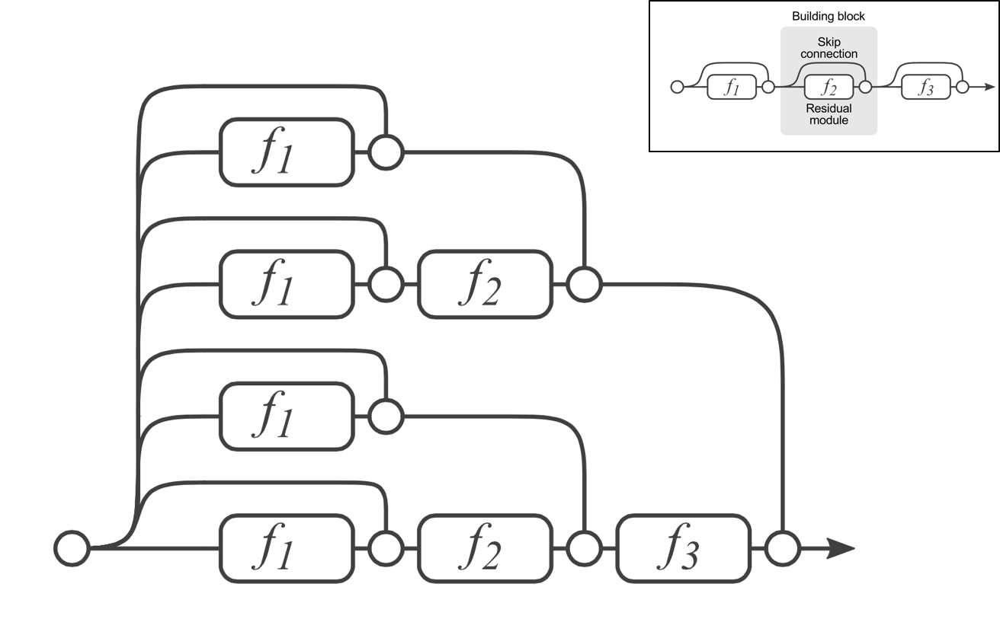
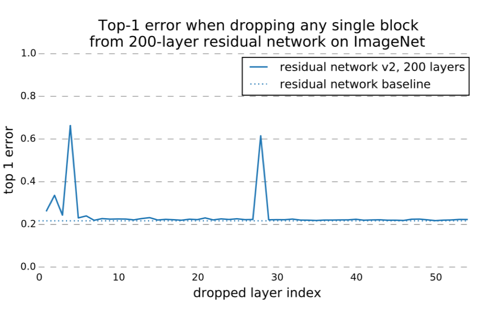
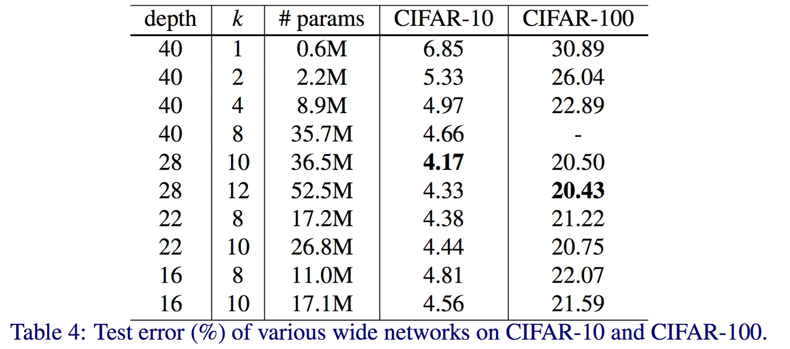
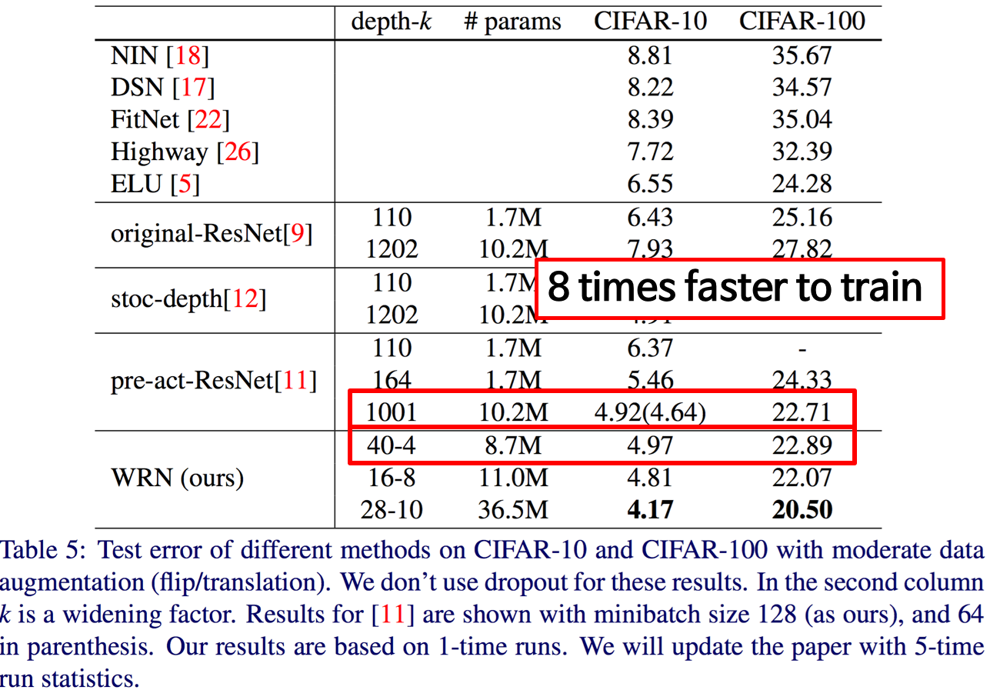

# Resodial Network가 왜 잘 되는지 해석해보기

- 과연 deep한 network가 좋은지를 다루고 있는 논문들을 통해 ResNet을 더 자세히 분석하고 network에서 depth가 가지는 의미를 알아볼 예정입니다

## Deep Residual Networks
- 152 layers
- ILSVRC 2015, ImageNet Detection, ImageNet localization , COCO detection, COCO segmentation 1st

### 문제 제기
- Deep한 네트워크가 좋은 것인가?
- 언제까지 좋은가?
- deep한 네트워크를 학습시키기 어렵다는 문제들 (vanising/exploding gradients) -> 좋은 초기화 방법론과 batcn normalization, 좋은 activation function(ReLU)로 해결 가능
- Degradation 문제가 발생
	- Deep한 네트워크가 그냥 성능이 안좋음
- ResNet이 사용하기 쉽고, 성능이 더 잘나옴. 그러나 왜 잘되는지에 대한 이야기가 없었음

### ResNet is an ensemble model
- ResNet이 왜 잘되는지 설명한 논문

#### Ensemble Model
- bagging
	- 여러개의 모델을 만들어서, 여러개의 정보를 취합한 것을 가지고 학습시키면 결과적으로 잘된다! 

- ResNet은 bootstrap은 없음(데이터가 하나로 고정)
- 만든 모델이 Skip Connection이 있는데 이것이 앙상블과 같다!

#### 레이어를 없애면 어떻게 될까?
- f2 : 학습했던 convolution을 없애버리겠다!

- 뒷단은 성능 차이가 거의 없음
- 튄 부분은 max pooling이 있던 시점!
- 레이어의 개수를 없앤 것은(=member를 없앤 것) 성능이 부드럽게(smoothly) 떨어지기 때문에 앙상블 모델로 볼 수 있다!

#### Ensemlbe of shallow nets?
- (50개일 경우) 2개의 갈림길을 만드는 것이기 때문에 중앙값은 25고 binomial distribution을 따름
- 95%가 19-35개 사이에 있으니 50개에 비하면 35개가 shallow!
- 이 부분은 살짝 논란의 여지가 있긴 함..

## Wide Residual Networks
- 딥한 것만이 중요한 것은 아니다
- 실험이 많이 들어가있으니, 읽어보면 감을 익힐 수 있음!

### 문제 제기
- 1x1 convolution을 넣어주는 것이 항상 좋은것만은 아니다. 안좋을 수 있지 않을까?

### 본문

- 40-8과 28-10을 비교해보면 파라미터의 수는 비슷한데 depth가 28인 것이 성능이 더 좋음
- 40-8과 22-8을 비교해보면 depth가 22인 것이 성능이 더 좋음

- 2개의 가장 큰 차이점은 학습 속도!!!!! 
- gpu를 사용한다는 것은 동시에 이미지를 학습시킬 수 있다는 것
- gpu가 많아도 depth가 많아지면 시간이 오래걸림(앞단을 학습해야지만 뒷단을 학습할 수 있기에..)
- Depth를 줄이고 채널수를 늘리는 것이 성능은 더 좋아짐 (28-10)

### 이 논문의 결론
- 채널을 늘리는 것이 성능 향상에 도움이 됨
- 너무 데이터가 많아지기 전에는 채널과 depth를 둘 다 조절하는 것이 좋다
- 학습시키는 관점에서 채널수를 늘리는 것이 학습이 더 쉽다
- 마냥 Depth를 늘리는것보다 채널을 확 늘려보는 것도 분류문제에선 좋은 성능을 낼수도 있다!라는 방향으로 튜닝을 해보는 것도 좋을 것 같습니다