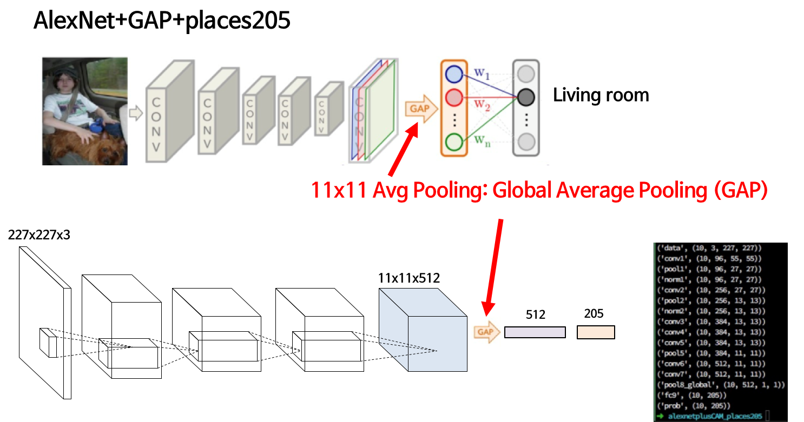
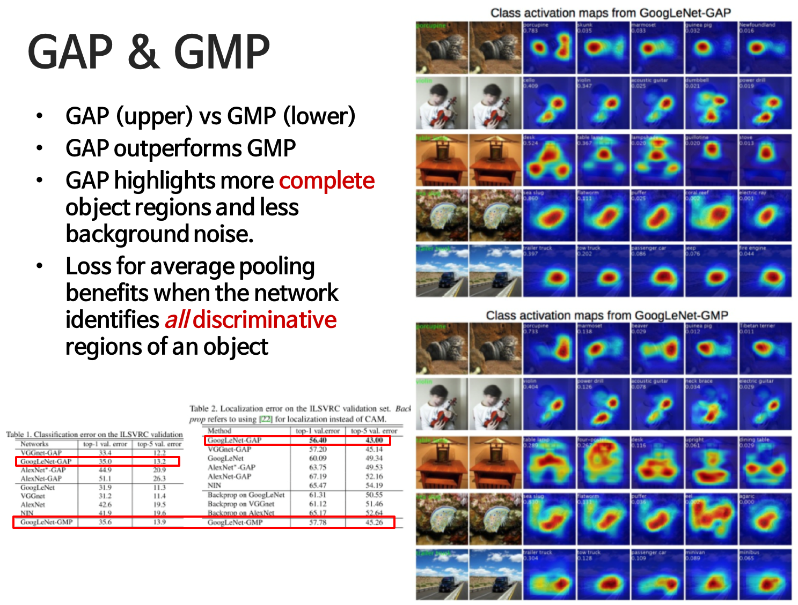

# Weakly Supervised Localization
- 이번 강의는 Weakly Supervised Localization과 Class Activation Map에 대해 알아볼 예정입니다
- 어떤 물체를 인식해 분류하는 것을 넘어 이미지 내의 어디에 분류해낸 물체가 있는지 알아내는 방법을 위 2가지 방법론을 통해 알아볼 것입니다

## Introduction
- Localization : Detect
- 어디에 물체가 있다는 정보가 데이터셋에 있어야 하는데, 그러면 이미지마다 어디에 뭐가 있는지 알려줘야 해서 데이터셋을 만들기 어려움
- Weakly Supervised Localization의 데이터셋은 이미지와 라벨만 존재하는데 네트워크가 알아서 해당 이미지가 어디있는지 알려줌

- Convolution이 내부에 어떻게 일어나는지 확인해보고, 그것을 통해 물체가 어디있는지 알아보자
	- Class Activation Map (CAM)
	- CNN을 1번만 돌려도 output이 나옴
	- 의료 영상에서 엄청 중요함. 이 사람이 폐암이다 결핵이다를 알려주는 것이 아니라, X-ray 사진에서 이 부분때문에 문제가 있다고 알려줘야 의사/사람이 확인
	- CNN을 디버깅하는 입장에서 엄청 중요함. 왜 이 CNN이 이런 결정을 내렸는지 알아볼 필요가 있는 경우! CNN 성능이 잘 안나오는데, 그렇다면 이 이미지가 어디를 집중하고 보고 있는지 확인할 때 사용할 수 있음
	- 바운딩 박스 없이도 해보자!

## [Learning Deep Features for Discriminative Localization(2015)](https://github.com/sjchoi86/dl_tutorials_10weeks/blob/master/papers/Learning%20Deep%20Features%20for%20Discriminative%20Localization%20.pdf)

- 구현이 참 쉬움
- CNN network를 정의한 후, feature map을 통해 gap를 해 벡터를 얻고 그 벡터를 통해 분류를 합니다!
- 11x11 Avg Pooling : Global Average Pooling(GAP)
	- 왜 잘되는지? 물리적 의미를 아는 것이 중요

### Class Activation Map (CAM)
- convolution feature map : 앞단에서 convolution을 통해 얻어지는 정보
- convolution : 얼마나 비슷한지를 나타냄. feature map의 채널들이 의미하는 것은 해당하는 convolution filter 모양으로 이미지를 찍었을 때 나오는 response같은 것
- GAP는 global response를 평균내는 것 
	- 이미지 안에 해당 filter 모양이 얼마나 들어있나(위치는 평균낸 것이기 때문에 알 수 없음)
	- filter feature map에는 위치가 존재함! 왼쪽 아래에 response가 나왔다면 거기 있는 것
	- GAP을 통해 특징(부위)별로 정보를 나타냄. 칼라 벡터들을 가지고 마지막에 Australian terrier인지 판단!(해당 클래스와 얼마나 연결되어 있는지?)
	- weight sum을 해서 activatin map을 얻음
	- weight : 각각의 feature들에 대한 (최종 분류할 클래스에 대한) 중요도! 
	- 각각의 convolution feature map 채널 : 주어진 이미지가 있을 때, 해당 커널의 리스펀스들(위치)
	
### Results
- 틀린 분류를 하더라도, 어디를 보고 분류했는지 알 수 있기 때문에 데이터가 이상한건지, 뉴럴넷이 잘못된건지 판단할 수 있는 지표가 됨

### GAP vs GMP

- GAP : 평균
	- 물체 전체에 대한 것을 잡음
	- All discriminative part를 잡기에 성능이 좋음
- GMP : 제일 큰 값을 사용
	- 단 하나의 discriminative part 잡음
- GAP와 GMP의 분류 성능은 비슷

### Localization
- 바운딩 박스를 치지 않고 히트맵을 사용
- 히트맵 주변을 네모로 쳐줌
- 성능이 괜찮게 나옴
 
### weakly vs fully-supervised
- 당연히 동일한 네트워크를 활용하면 위치를 알려준 네트워크가 더 잘됨
- 따라서 위치를 알려준 네트워크는 AlexNet, 아닌 것은 GoogLeNet을 사용할 경우엔 성능이 비슷함

### Deep Features for Localization
- 어떤 Activity를 하고 있는지도 분류할 수 있음
- cooking, playing 기타 등등

### Scene Recognition + Localization
- 클래스가 있고, 클래스에 대한 서브 카테고리가 존재(위치 데이터도 있음!)
- cam을 구했을 때, 거기서 나오는 위치가 실제 물체의 위치인지 봤더니 많이 맞춤!

### Concept localization
- mirror in lake, view out of window도 학습
- positive set : short phrase in text caption
- negative set : randomly selected images

### Text detector
- 학습 데이터를 만드는 과정이 정말 재밌음
- positive set : 350 google street view images
- negative set : outdoor scene images

## 결론
- Class Activation Map (using GAP)
- 학습 데이터 자체는 분류를 하는데, 그 데이터를 가지고 위치를 찾는 localization을 실행
	- 바운딩 박스가 주어지지 않고도 문제를 풀었음!
- CAM은 어디가 높게 나오는지 보여주기 때문에 유익함
- CAM은 다른 visual recognition 문제에 잘 적용됨
- 맨 뒷단만 GAP로 바꿔서 넣어주면 됨
