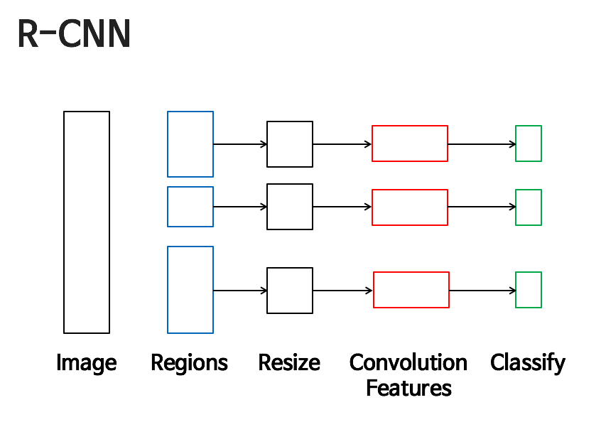
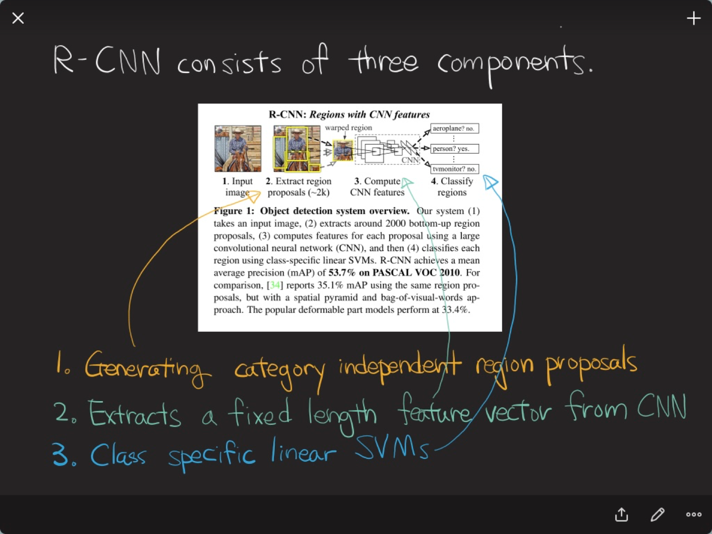
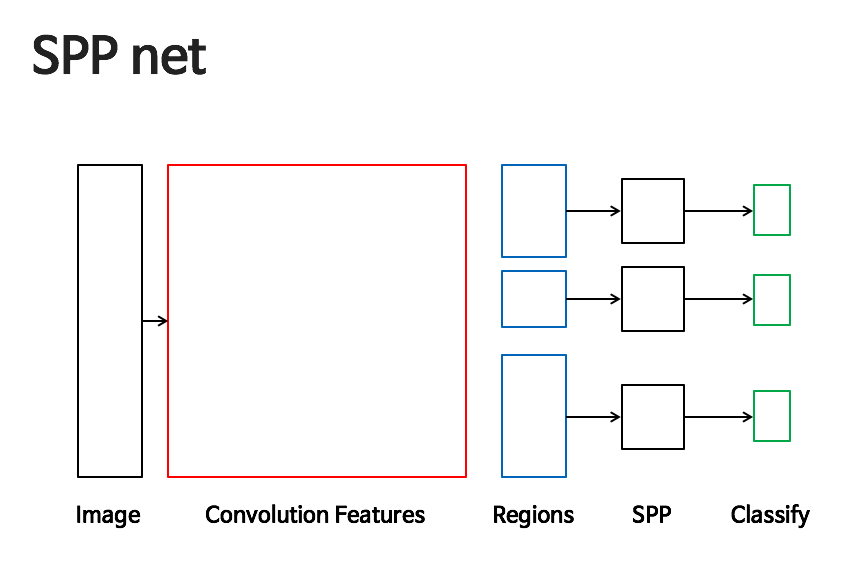
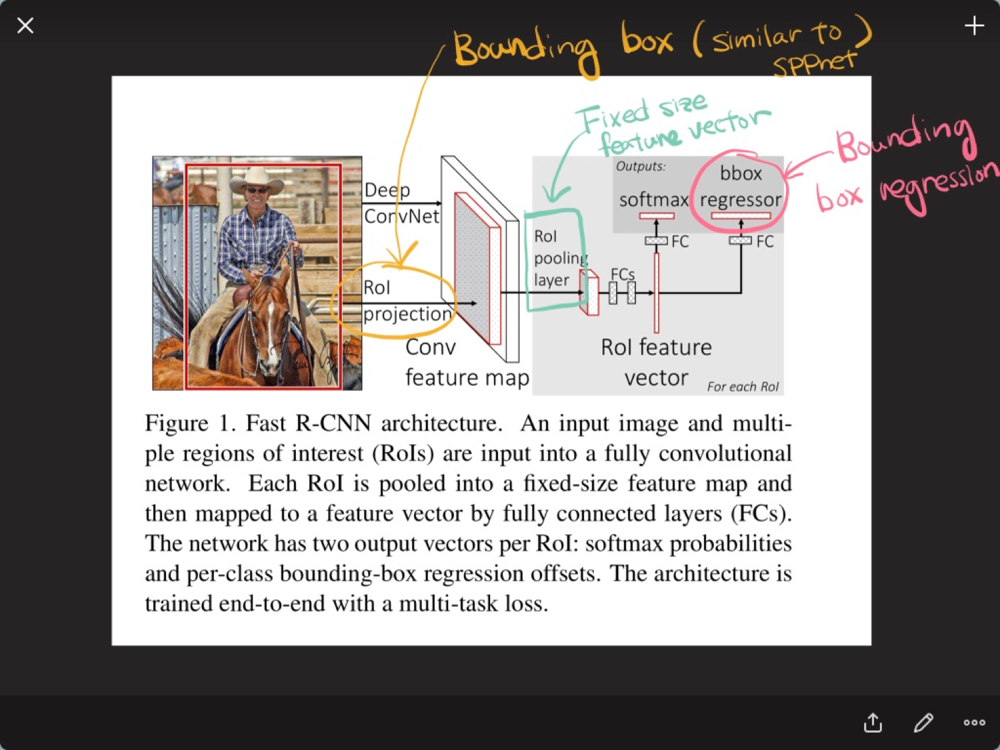
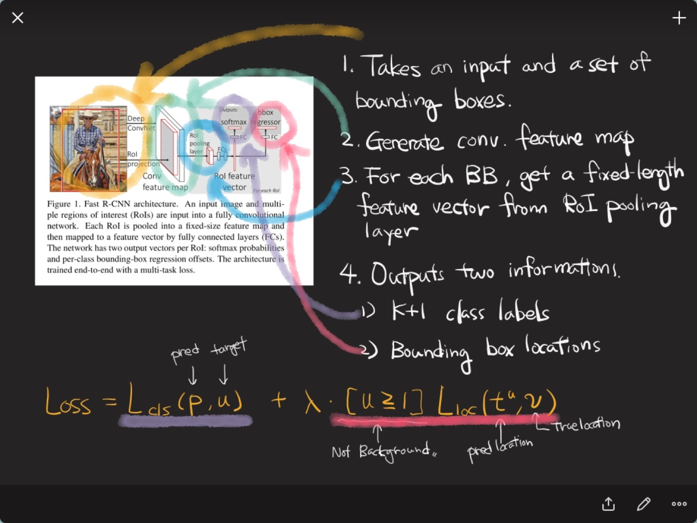
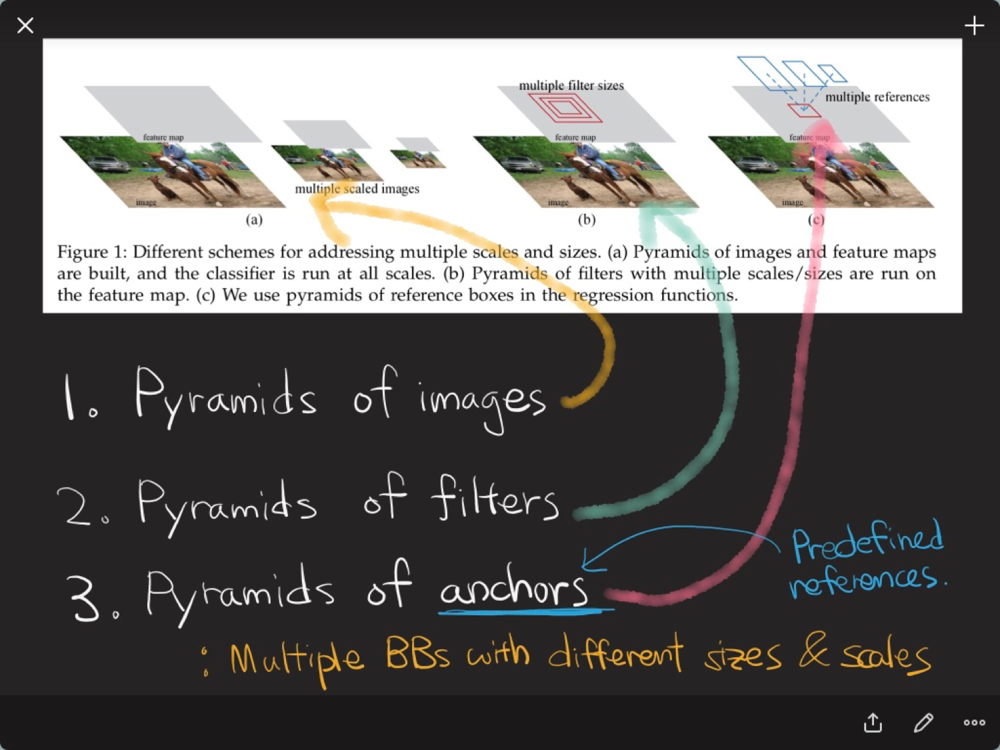
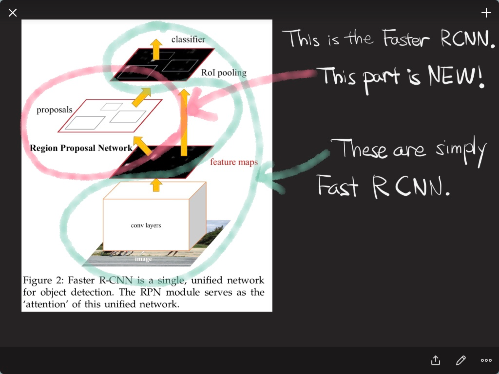
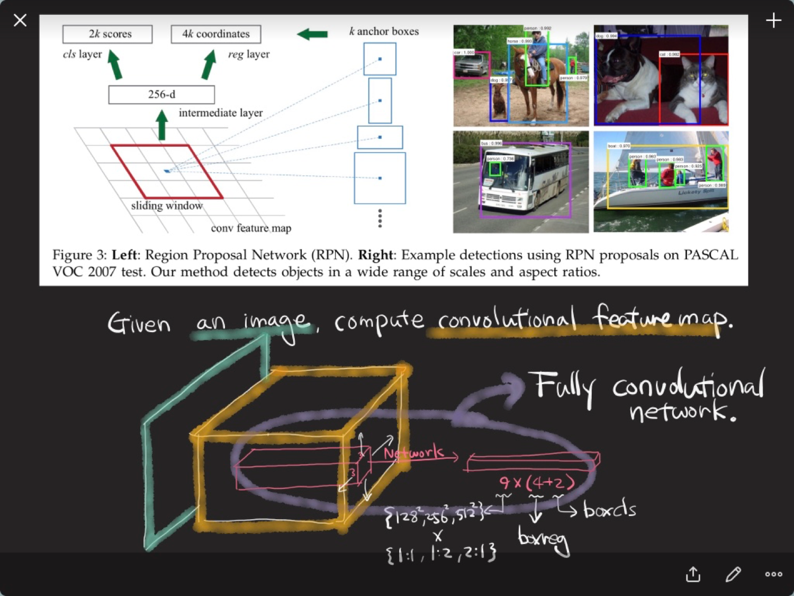
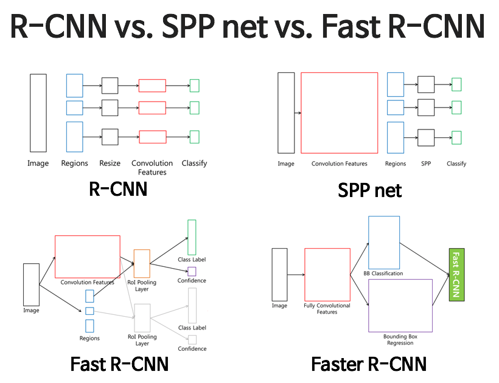

# Image Detection 방법론: RCNN, SPPnet, FastRCNN, FasterRCNN

- 앞 강의에서 localization과 언급됐던 Image Detection 방법론을 알아볼 예정입니다
- 이번 시간에는 R-CNN 계열의 논문을 보며 진행합니다

## R-CNN

- 딥러닝을 통해 image detection을 풀었던 시초의 논문
- 매우 간단!

### 방법론
- 이미지 안에서 feature를 CNN으로 뽑아요
- 그러나 물체에 네모에 쳐주는 것이 상대적으로 어려운 상황(end to end가 힘듬)
- Selectvie search 알고리즘 사용
	- 바운딩 박스를 많이 뽑아냄(Train 데이터와 상관없는 방법론을 사용) -> 그 박스를 resize -> pretrain cnn -> feature -> 분류
- 분류시 서포트 벡터머신(linear-SVM)을 사용
- Featrue Extract
	- AlexNet을 사용
- 찾고싶은 물체의 개수가 20개라면 분류의 class는 20+1 (1개는 Background로 필요없는 박스)

- Region proposals
	- 2000개의 바운딩 박스를 뽑아냄
	- 여기서 시간이 오래 걸려요

### Training
- Region Proposal을 통해 네모를 많이 생성! 그 후 실제 네모와 얼마나 겹치는지 찾아봄
- Bounding box regression
	- Bounding box가 어떻게 옮겨져야 더 실제 bounding box와 비슷해지는지 찾는 것
	- 중심점, 종횡비 ratio 를 추가적으로 학습

## SPPnet

### Introduction
- Spatial Pyramid Pooling, 주로 컴퓨터 비전에서 많이 나옴
- 내가 찾고싶은 물체의 사이즈를 알 수 없음. 어떤 분류기가 있는데, 도장의 모양이 계속 달라져야 사이즈를 고려할 수 있음
- 하나의 이미지를 반으로 줄인 것, 등등을 한번에 고려한 분류기를 만듬
- image scale에 조금 더 로버스트

- R-CNN이 돌아가는 횟수가 너무 많이 돌아가는 단점을 보완! CNN이 1번 돌아감

### 문제 제기
- CNN은 입력 이미지가 고정되어야 한다. 왜 그럴까?	
- 이런 문제를 보완하기 위해 R-CNN은 바운딩 박스를 많이 뽑았음
- SPPnet은 feature map 위에서 해당 영역의 정보를 빼옴

### Detection
- RCNN은 resize해서 cnn에 넣었다면, SPPnet은 convolution feature map 위에서 reshape해서 spatial pyramid pooling
- 그 후 fully connected layer에 넣음!

## Fast R-CNN

- 영역을 나누고, 뽑아서 분류기를 보냈음

### Architecture

- 이미지 -> CNN -> Feature Map 
- RoI(Regions of interest) -> Feature map 위에 올림
- RoI pooling layer

- 입력 이미지에서 바운딩 박스를 뽑음
- conv feature map을 만듬
- 각 이미지 바운딩 박스에서 fixed lenghth feature vector를 만듬(RoI pooling)
- K=1 class labels
- boungdin box 위치를 수정해 맞춤

## Faster R-CNN

- 딥러닝을 이용한 region proposal이 들어감!
- 바운딩 박스를 뽑는 부분에서 딥러닝을 도입
- Region Proposal Net + Fast RCNN

### 사이즈와 스케일이 다를 때 고려할 수 있는 방법

1. pyramids of images
	- Spatial Pyramid Pooling같은 것. 이미지 자체의 사이즈를 줄여서 줄어든 Multiple Scale 이미지를 한번에 고려
2. pyramids of filters
	- 도장의 크기를 변경. ASPP가 filter size를 바꾸는 것과 유사
3. pyramids of anchors
	- anchors : 미리 정의되어 있는 바운딩 박스 크기(predefined)
	- anchors를 얼만큼 조작해야 원래 바운딩 박스가 될 수 있을지를 찾음!

	
- proposal net : 이미지를 입력으로 받아서 바운딩 박스만 뱉어줌

	
- k개의 anchor box를 만듬. k개의 anchor마다 positive / negative를 줌 (score)	

### results
- 미리 anchor box를 만듬! 마치 residual network같이 진행
- 큰 물체와 작은 물체를 잘 잡음

