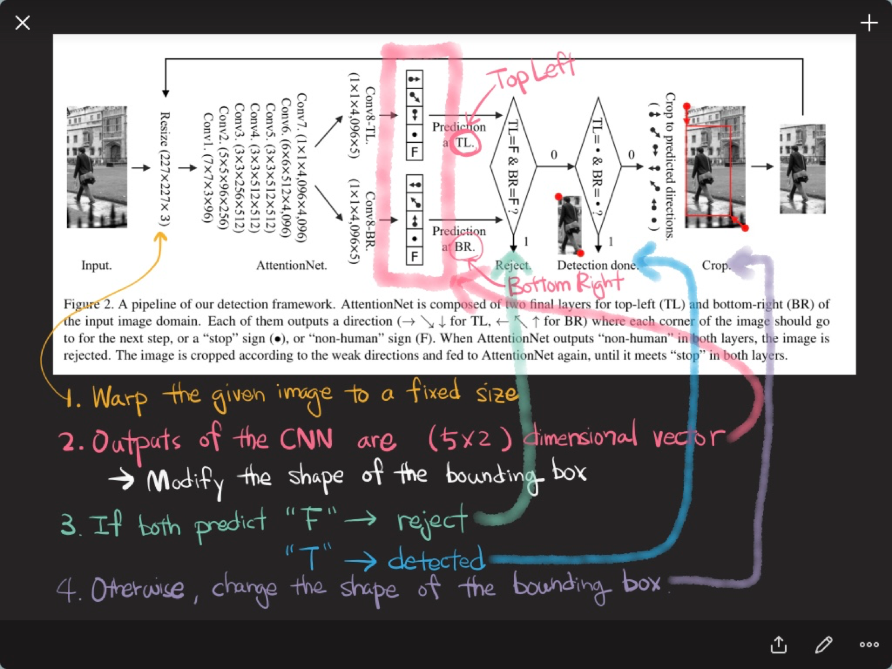
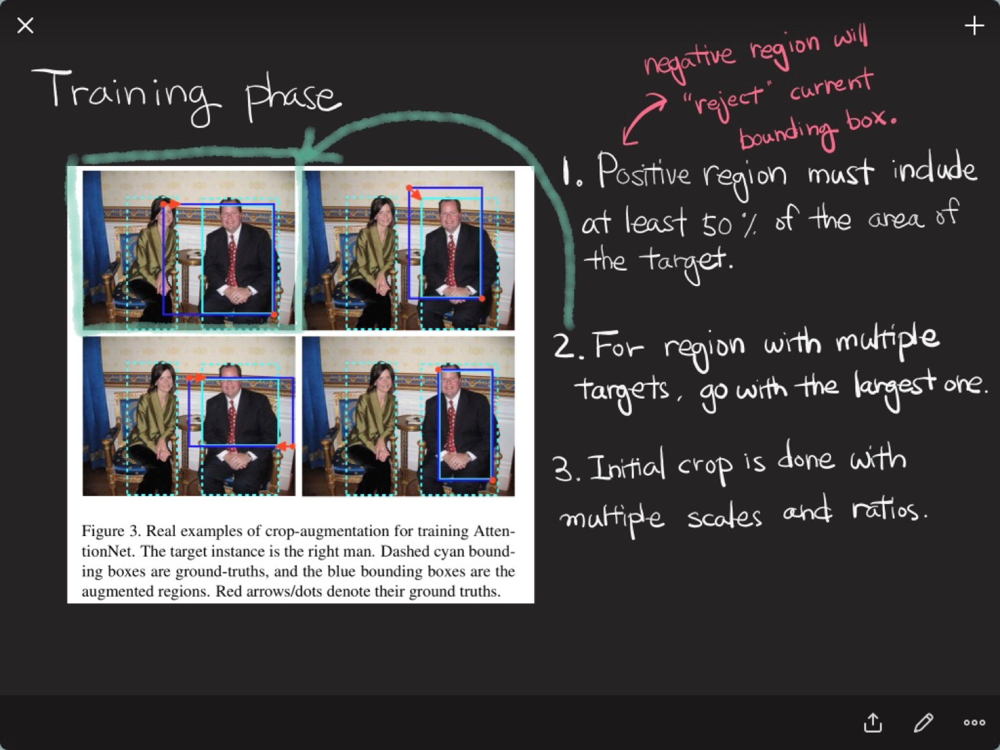
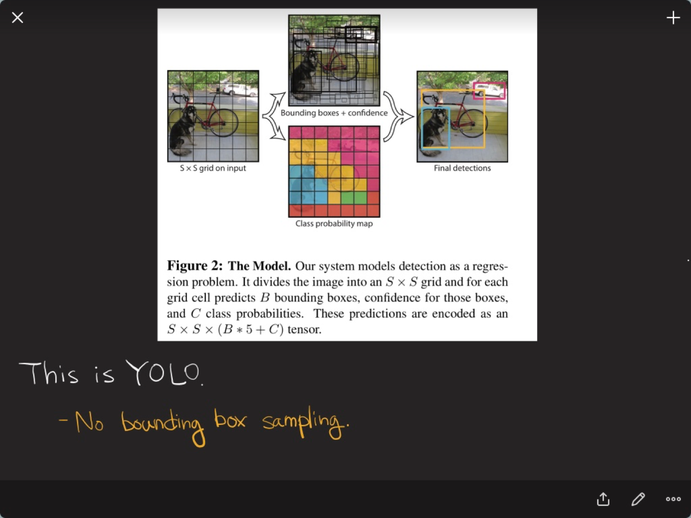
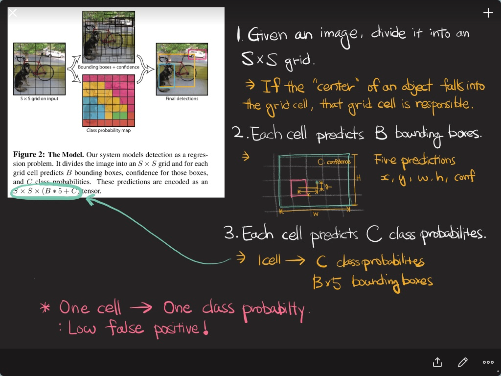
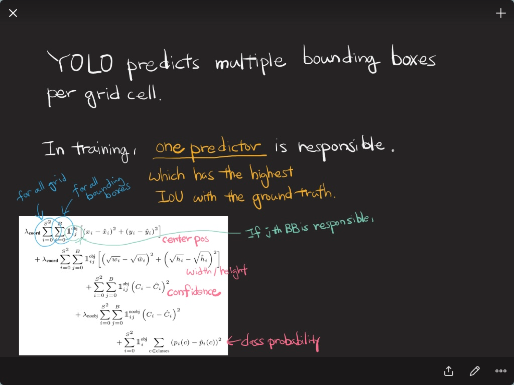
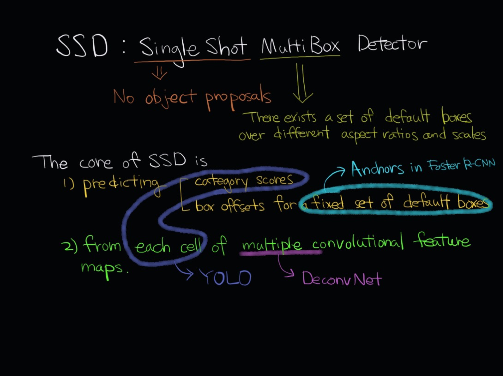
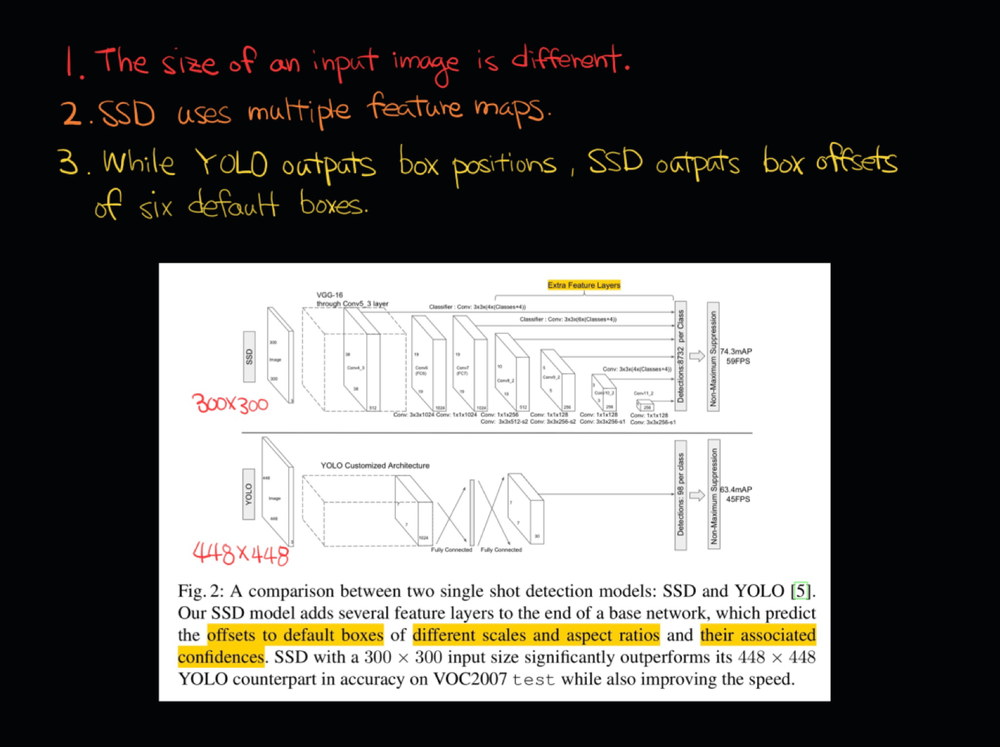

# Image Detection : AttentionNet, SSD, YOLO, YOLOv2

- YOLO, SSD, YOLOv2는 굉장히 중요한 방법론이며 AttentionNet 역시 실용적으로 색다른곳에 사용될 수 있기에 관심과 흥미를 가지고 집중해 학습!

## AttentionNet
- Detection 문제를 조금 다른 방식으로 접근함
- 네모의 크기를 바꾸는 문제로 바꿈! 
- 가정 : 이미지에는 물체가 1개 있다 

- exact bounding box를 측정
- object proposal, classifiers, post bounding box regressions 같은 것들이 모두 없고 바운딩 박스만 찾음
- Single Object Detecion Tasks

- 이미지 리사이즈, 5x2 output
- 2개의 컨트롤러가 둘 다 F면 Reject, T면 바운딩 박스가 되고 두 케이스가 아니라면 해당 방향으로 바운딩 박스를 조금 옮겨서 resize해서 다시 AttentionNet에 넣음

- Train시 임의의 네모를 치고 어떻게 움직여야 바운딩 박스와 가까워지는지 구함
- Multiple target이라면 가장 큰 것으로 감
- 첫 initial crop은 랜덤하게
- 여러개의 종횡비를 동시에 집어넣어 학습
- 이미지 안에 여러개의 object가 있는 경우
	- initial merge
	- 크기를 조금 키우고
	- re-initialize
	- re-detections
	- final merge
	- 원래 이 알고리즘은 1개를 찾으려고 했기에, 여러개를 찾는 경우엔 복잡
- 이 방법론은 어떤 이미지가 주어졌을 때 정확한 바운딩 박스를 잡는 것을 목표로 고안!

## YOLO
- You Only Look Once!
- Extremely Fast!
- Faster R-CNN과 유사하지만 더 빠름!
- 내셔널 지오그래픽을 보여주면서(캠으로) 이미지를 인식

### 방법론
- 바운딩 박스를 찾는것과 바운딩 박스에 해당하는 클래스를 동시에 찾음!
- Detection 문제를 Regression 문제로 바꿈

- CNN을 통해 7x7 까지 줄여서 49개의 바운딩 박스가 나옴. 49개의 그리드마다 클래스를 1개씩 부여하고, 바운딩 박스를 B(2)개 부여함!
- SxSx(B*5+C) 문제로 바꿔버림

- YOLO는 여러개의 바운딩 박스를 그리드셀마다 예측합니다

### 제한
- 바운딩 박스가 작은 것이 여러개 있는 경우(작은 이미지가 붙어있는 경우)엔 적합하지 않음
- 바운딩 박스의 위치가 정확하지 않음
- 스코어를 측정할 땐 좋지 않음

## SSD : Single Shot multiBox Detector
- 구글에서 코드를 공개했습니다!
- YOLO의 컨셉과 Faster RCNN region proposal network를 합친 것

- Single Shot : object proposals이 없이 한번에 탕! convolution feature map의 grid마다 나오는 것
- Multi Box : Anchor!

### SSD Core
1. predicting category score / box offsets
2. 각각의 셀에서 나온 convolutional feature map

- YOLO와 차이! YOLO가 input size가 더 큼 -> 속도 차이

## YOLO 9000
- YOLO에서 어떤 것을 바꿨더니 성능이 좋아졌다! 라는 내용이 써있음
- 삽질을 통해 나온 내용들이 담겨있음

### 왜 안될까?
- Localization errors
- Low recall compared region proposal base method
	- precision : 내가 정답을 말했을 때, 정답이 얼마나 있는지
	- recall : 내가 암환자를 60명 불렀을 때, 실제 암환자를 얼마나 커버했는가
	- 내가 몇개를 자주 불러내는지에 dependent
	- 7x7x2 = 98개의 바운딩박스를 뽑아냄. 기존의 RCNN은 2000개를 뽑음. 따라서 YOLO가 recall이 낮음

### 해결 방법
1. Batch Normalization
2. High Resolution (고해상도)
3. Anchor Boxes : 바운딩 박스 사이즈를 규정해놓고 offset을 찾음
4. Dimension Clusters : 트레인 데이터의 바운딩 박스를 클러스터링해서, 많이 들어가있는 바운딩 박스 크기를 anchor boxes의 사이즈를 정함
5. Location Prediciont : 박스 오프셋, 박스 스케일링(일정비)를 찾음
6. Fine-grained Features : 26x26 feature map을 사용(맥스 풀링을 하기 전 정보를 합침)
7. Multi-Scale Training : 입력 이미지 사이즈를 바꿔가면서 학습

### Stronger
1. Hierarchical Classfication
	- 1개의 이미지를 여러 라벨이 들어감. 서로 다른 계층 구조를 갖는 것을 나눔 (상위 / 하위 계층) 분류할 때 계층별 loss function을 만든 후, soft max의 평균/합으로 분류를 정의
	- 9,000개의 라벨을 가진 문제를 풀게 됨

  

