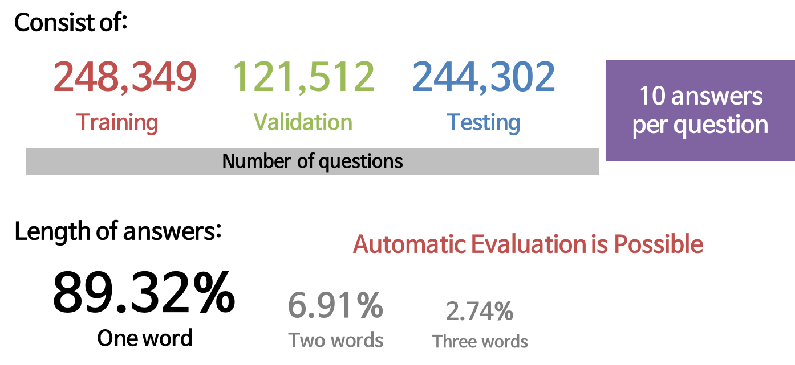
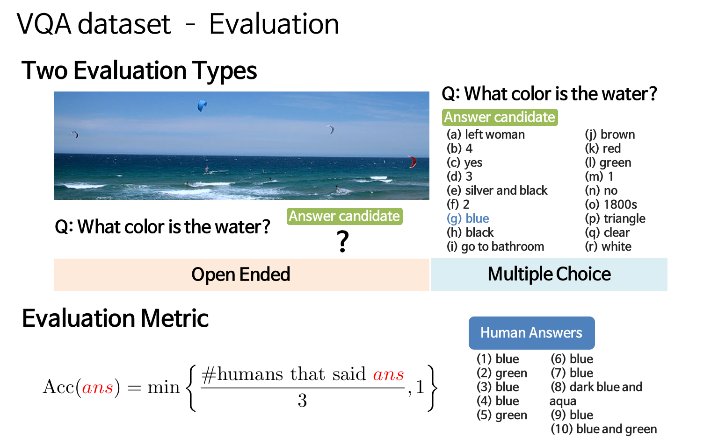
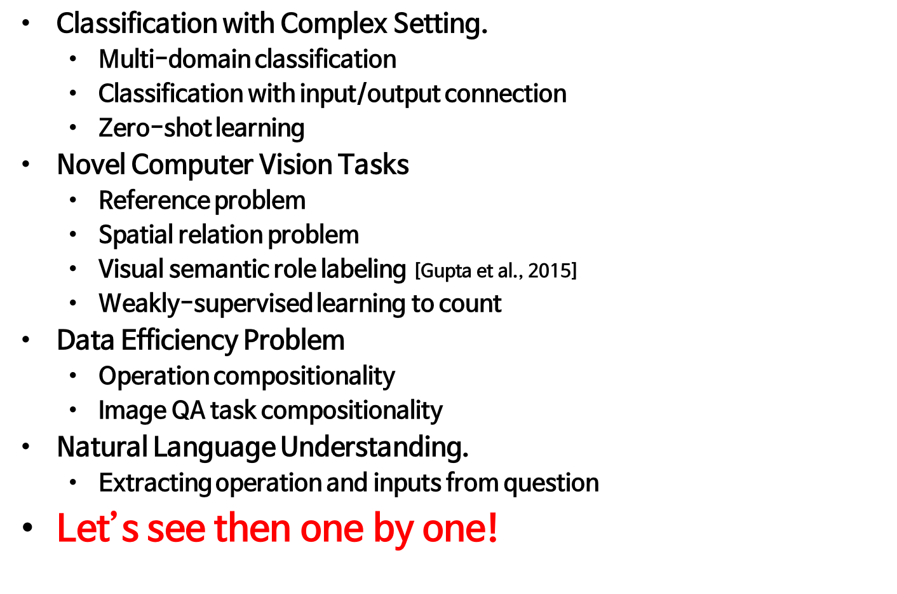
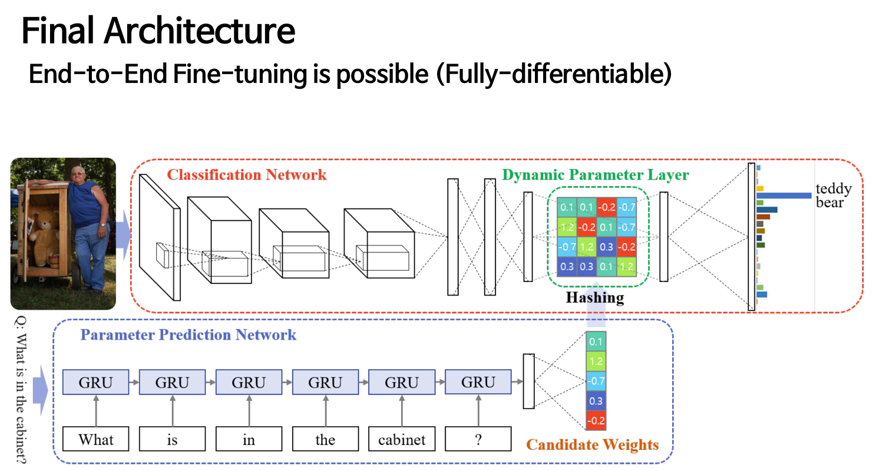
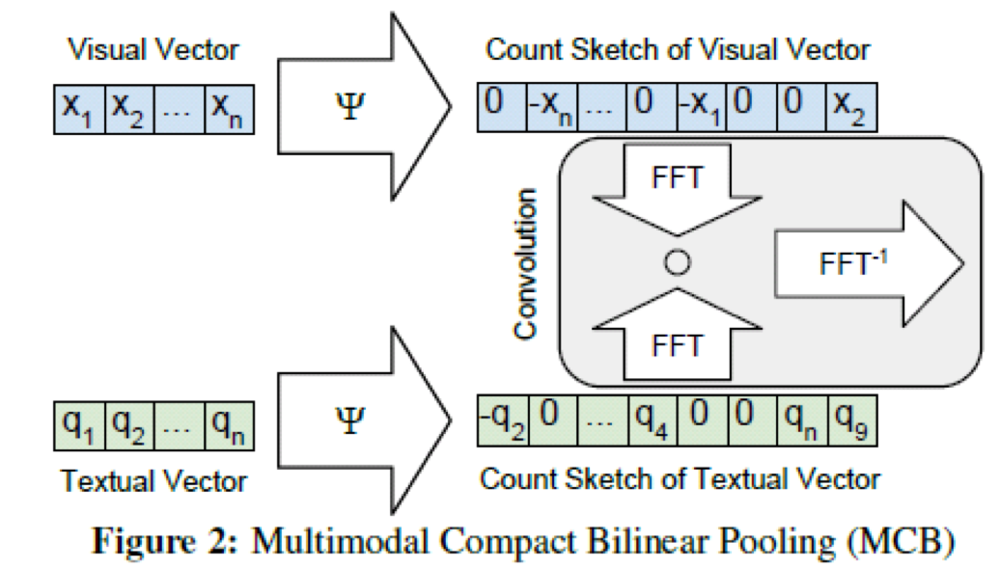
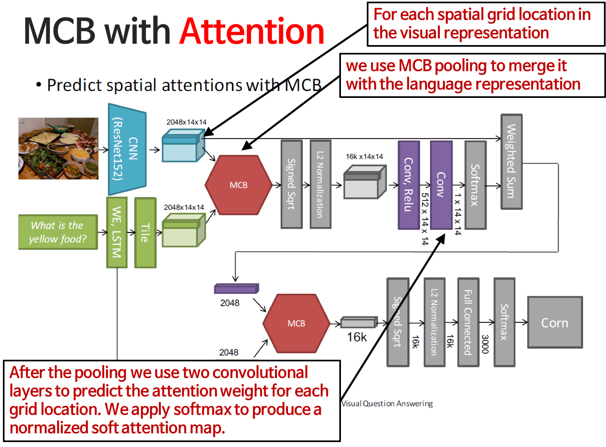

# 이미지와 질문이 주어졌을 때 답을 맞추는 Visual QnA
- 문제를 해결하는 대표적인 2개의 방법론 DPPnet(Dynamic Parameter Prediction)과 MCB(Multimodal Compact Bilinear) Pooling for VQA를 알아볼 것입니다!

## VQA 
- 이미지가 주어지고 질문이 주어졌을 때 정답을 알려주는 것!
- VQA 대회가 열리기도 함

- 기본 지식들의 질문들이 주류를 이룸

- VQA는 여러가지 문제로 이루어져 있음
	- 어떤 이미지에 대한 질문의 답은 그 이미지를 설명하는 속성으로 볼 수 있음!
	- 사람과 같이 생각할 수 있어야 함. ex) 사람 오른쪽에 강아지가 있는 사진을 찾고싶음
	- NLP

	

### Multi-domain classification
- 질문에 따라 답을 해야하는데, 어떤 분류를 할 지에 따라 달라짐
- object classification + action classification 
- object classifier + yes/no classifier
- zero shot learning : 한번도 본 적 없는 데이터를 어떻게 처리할 것인가?(One shot learning은 한번 본 것)

### Novel Computer Vision Task
- 어떤 것을 지칭하는지에 따라 다른 답변이 나오는 경우
- reference problem 
	- detection 문제와 유사!(어디 있는지 알아야 하니!)
- Spatial Relation Problem 
	- 어떤 물체 옆에 뭐가 있는지?
- Visual semantic role labeling 
	- 행위에 대한 것
- Counting
	- 정말 어려운 문제..
	- 어려운 이유는 일반적으로 이미지 처리할 때, CNN! CNN이 Counting에 적합한 구조는 아님. CNN은 convolution filter가 전체 이미지를 훑고, fully connected layer를 통해 데이터가 섞임

### Data Efficiency Problem
- 요새 핫하게 연구되고 있는 분야
- Operation Compositionality
	- 여러 문제를 풀면 그것들이 우리 안에서 정리가 됨
	- class를 찾는 문제 -> 문제를 통해 사람이 어떤 것인지 깨달을 수 있음 -> 사람 count
	- 가능한 모든 경우의 수를 고려하면 학습 데이터가 커짐
- Image QA task compositionality
	- 나눈 것도 풀 수 있어야 함
	- 모든 composition.. 데이터셋이 커짐
	- ex) what the man on the horse is doing?

### Natural Language Understanding
- 자연어 처리를 잘해야 함..!
- 상대적으로 덜 주목받는.. Vision하시는 분들이 자연어 처리를 덜 하고있어서..?

### Solving VQA Approach	
- LSTM에 넣어서 시퀀스가 끝났을 때 마지막의 서스테이트를 feature로 사용
- 이미지는 CNN Feature를 추출

## DPPnet
- 우리가 이미지가 주어졌을 때, 이미지를 분류하는 네트워크를 어떻게 만들면 되냐면! 질문에 dependent하게!!

### Motivation
- 문제를 풀 경우, 이미지넷에서 pretrain된 network를 가지고 와서 뒷단만 fine tune
- 질문을 depedent하게 마지막 레이어를 만들어보자
- Switching parameters of a layer based on a question
	- Parameter Prediction Network를 만들어보자(마지막단의 weight를 예측)
	
### Parameter Prediction
- Question -> Extract Feature -> regression -> parameters
- LSTM / GRU를 활용
 

	
### Parameter Explosion
- fc-layer 파라미터의 개수가 너무 많음
- 해결하기 위해 Hashing Trick을 사용
	- 적은 숫자의 파라미터로 많은 수의 파라미터를 정의할 수 있음

 

## Multimodal Compact Bilinear Pooling for VQA
- 어떤 이미지가 있을 때, 무언가를 맞출 수 있으면 VQA를 풀 수 있는 것!
- Multimodal이 중요. 2개를 섞는 것이 중요!!!

### 방법론
- Image와 Question의 Combine
- 이미지와 질문의 상호관계가 중요! 
	- Concat (All elements can interact)
	- 같은 위치에 있는 것을 곱해서 사용 (Multiplicative interaction)
- Outer Product (외적) -> 모든 것들이 interaction이 존재
- 그러나 행렬의 dimension이 너무 커짐
- compact bilinear pooling 
	- 행렬이 어떠한 매핑을 통해 low dimension을 만들고 거기서 분석!
	- 두 벡터 사이의 convolution만 있으면 두 벡터를 외적에서 뽑아낸 feature와 동일하게 사용할 수 있음
- count sketch

 

### MCV with Attention
- Attention : 어떤 영역을 더 많이 보겠다

 