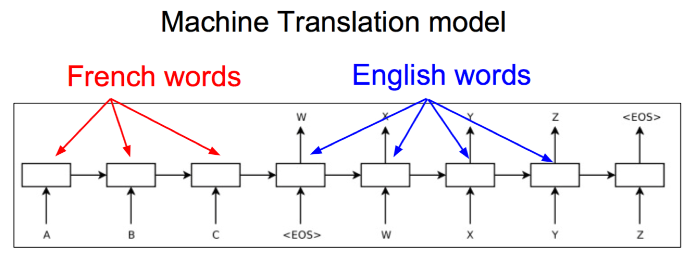
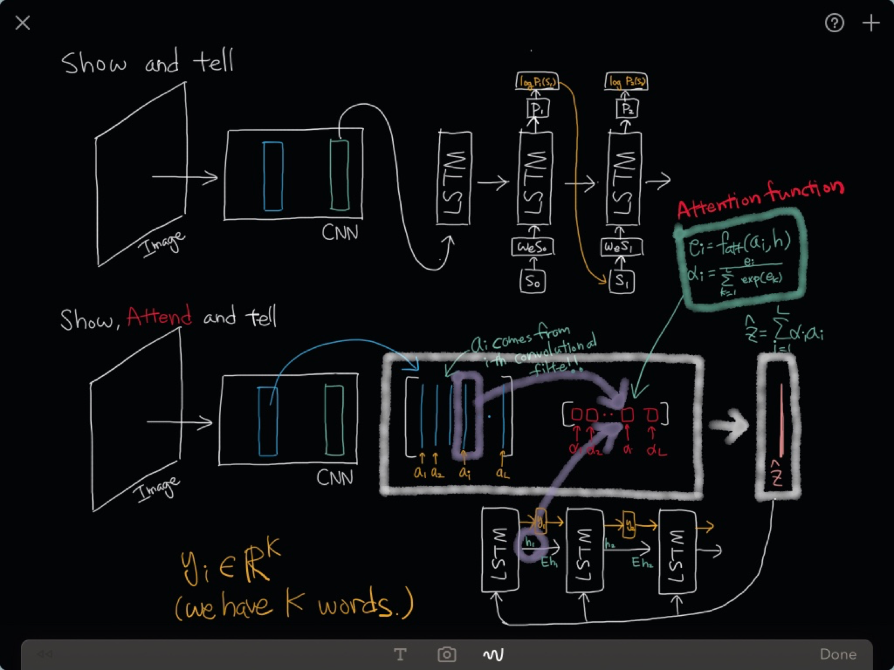
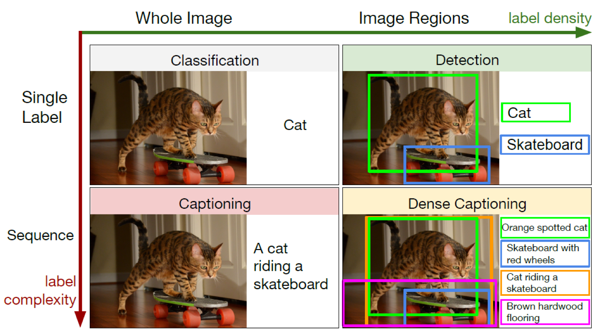
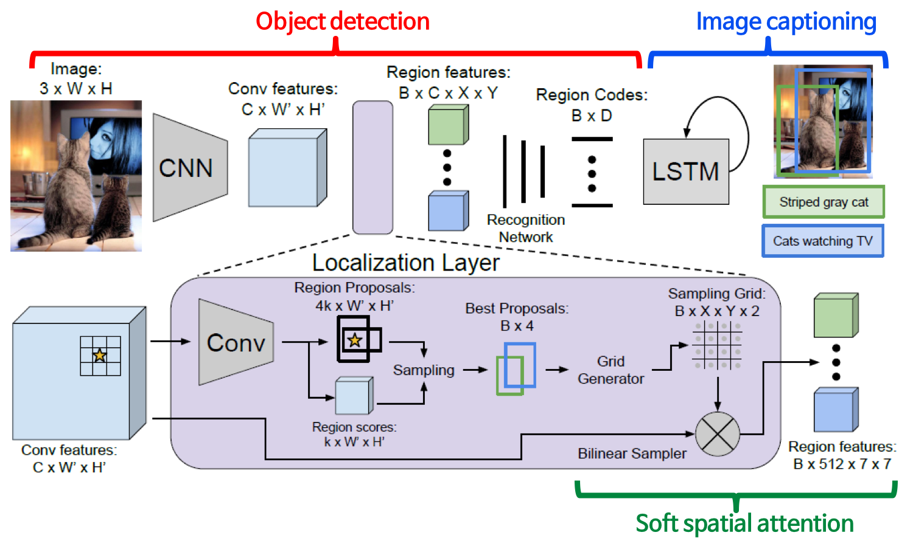
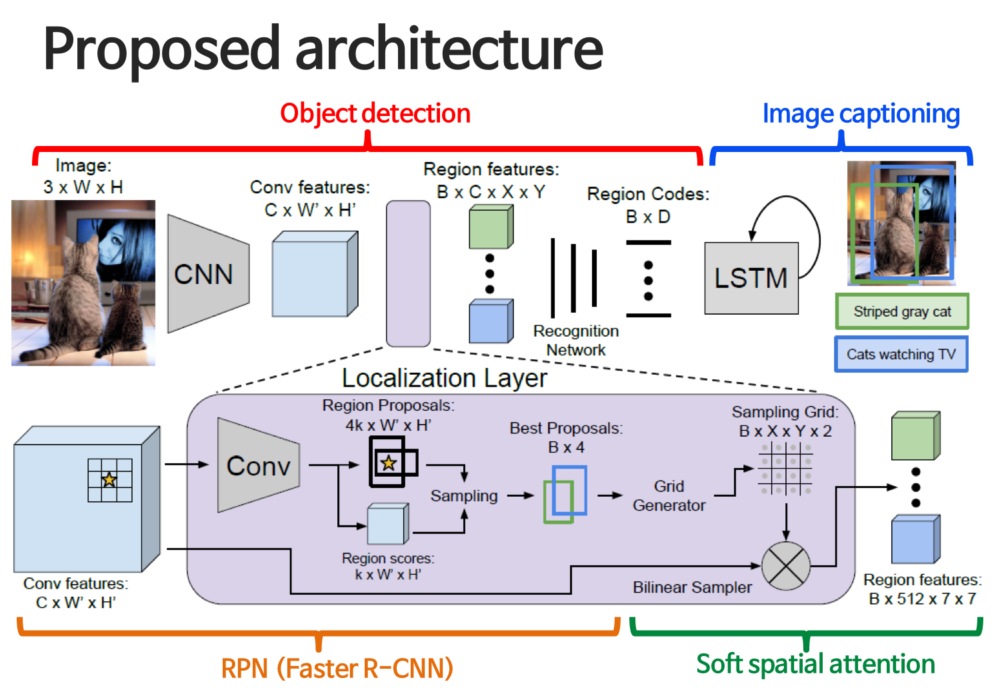

# 이미지를 설명하는 문장을 만들어내는 Image Captioning

## [Show and Tell Paper](https://github.com/sjchoi86/dl_tutorials_10weeks/blob/master/papers/Show%20and%20Tell-%20A%20Neural%20Image%20Caption%20Generator%20%20.pdf)

## Image Captioning 
- 어떤 이미지를 설명하는 문장을 만들어내는 것
- 사진의 description을 만들 수 있음 -> 검색에 대한 질을 높임
- 앞이 안보이는 분들에게 Image Captioning으로 지금 앞의 화면을 설명해줄 수 있음
- VQA와 다른 점은 질문이 주어져 있고, 이것은 질문이 아닌 description을 만듬!
- Multi modal learning
- CNN을 통해 이미지를 처리하고 RNN으로 문장을 만들어냅니다!

### Recurrent Nets
- 번역을 해주는 알고리즘은 RNN을 2개를 만듬. encoder, decoder 2개!
- 불어의 마지막에 들어있는 cell state가 앞에 있는 불어를 모두 표현하기에 충분하고 이 state를 통해 한국어로 복원할 수 있음

### Language Model
- 이전 단어들이 주어졌을 때 다음 단어에 대한 확률 분포
- P(next word | previous words)

### Test Phase
- Image -> CNN -> 결과를 RNN
- End Token이 나오면 Finish
- beam search
	- 첫번째에 이상하게 샘플링이 되면 뒤에선 잘 안될것임
	- 처음에 1개만 뽑지 않고, 여러개를 뽑고 거기서 기반해 작업을 수행

### Transfer learning
- ImageNet에서 pretrained weights를 사용
- word2vec에서 pretrained된 word vectors를 사용	

## [Show, Attend and Tell](https://github.com/sjchoi86/dl_tutorials_10weeks/blob/master/papers/Show%2C%20Attend%20and%20Tell-%20Neural%20Image%20Caption%20Generation%20with%20Visual%20Attention.pdf)
- Attention 메카니즘을 사용!
	- 내가 지금 주어진 이미지 안에서 어느 영역을 보고 지금 단어를 만들지
	- 이미지는 여러 component를 번갈아가면서 captioning
	- 이미지 안에서 특정 단어를 말할때마다 다른 영역을 봐야함

## [DenseCap](http://cs.stanford.edu/people/karpathy/densecap.pdf)

- Image Captioning을 영역별로 함
- 영역을 찾고, 영역에 대한 captioning(분류가 아닌!)
- 영역별로 많은 일들이 있기 때문에 이런 방법론을 활용함
- Dataset이 있었음
- Object Detection + Image captioning + Soft spatial attention

### Soft spatial attention
- 우리가 어떤 이미지 안에서 영역을 뽑고 싶음
- 그 영역이 바운딩 박스로 나오는 것을 원하지 않고, soft하게!
- 픽셀 단위에서 반쯤 걸쳐있을 때 어떻게 할지에 대해 이야기함

### Differentiable image sampling
- 이미지를 돌리고 싶은 경우 점들을 찾아줌! 매핑을 만들어줌

### Bilinear interpolation
- 어떤 값이 있을 때, 이것으로 고려
- 떨어져 있는 거리에 반비례하게 새로운 픽셀값을 정함

### Recognition network
- 이미지 캡셔닝!
- BRNN

