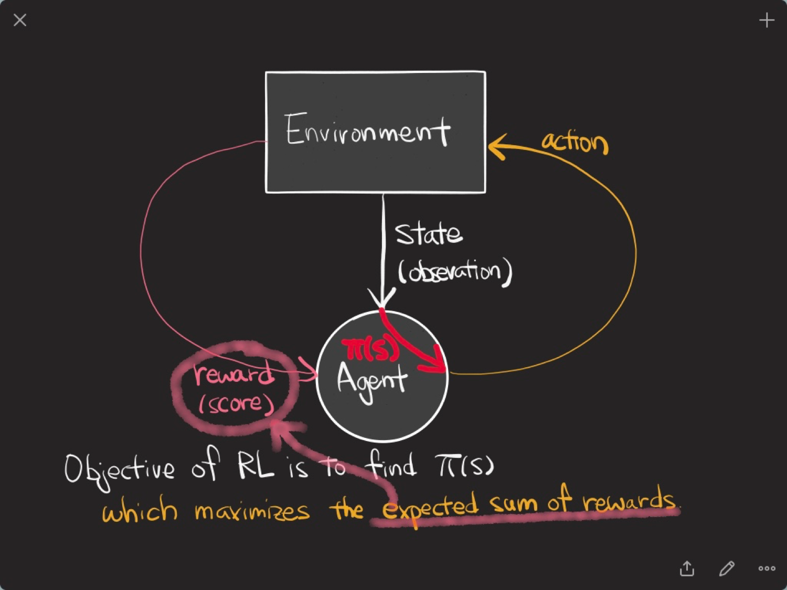
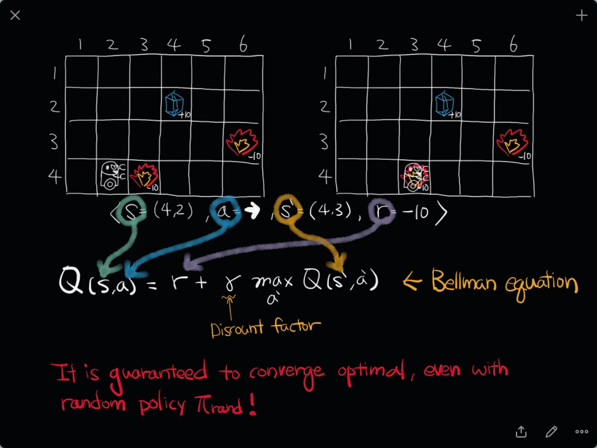

# 딥러닝을 이용한 강화학습

- Deep한 강화학습
- 최근 Hot한 강화학습

- 2개의 큰 갈래! DQN 시리즈와 Continuous output을 모델링하는 policy optimization

## [Playing Atari with Deep Reinforcement Learning(2013)](https://github.com/sjchoi86/dl_tutorials_10weeks/blob/master/papers/Playing%20Atari%20with%20Deep%20Reinforcement%20Learning.pdf)

- 기본적인 강화학습에 대해 이야기해볼거에요
- Supervised learning과 다른, 어떤 reward function이 주어졌을 때, 이 function을 많이 먹을 수 있는 expected sum of reward를 maximize하는 것이 강화학습!

- 어떤 상태가 주어짐. 우리의 문제에선 이미지(화면)
- 행동을 합니다(조이스틱을 누르거나, 버튼을 누르는 행위)
- 현재 reward를 get!

- 목적 : 최적의 policy(어떤 상태가 주어졌을 때, 어떤 행동을 고르는 것이 opti!)을 찾는 것



- 앞으로 얻을 reward를 최대화할 수 있는 action을 고름
- 문제는 내가 미래를 모름
- 미래를 고려한다는 것 때문에 강화학습이 상당히 재미있고, 많은 곳에 적용이 가능합니다

### MDP
- State
- Action
- Reward
- Policy
- Transition model 
	- 어느 상태에 있을 때, 그 상태에서 어떤 행동을 취했을 때 다음에 어느 상태로 이동할지에 대한 모델 
- Q value function


#### Q Learning
- R_t = 미래에 얻을 수 있는 reward의 합
- R_t = r_t + r*R_t+1
- Q(s_t, a_t)
	- 어느 상태에서 어느 행동을 했을 때, 앞으로 얻을 수 있는 행동의 합!
- 정의
	- 당장 얻을 수 있는 reward가 아닌 결과로 얻을 수 있는 미래의 점수
	- 게임이 끝났을 때 얻을 수 있는 가장 높은 점수
	- Action들을 하나씩 골라보면서, 제일 높은 Q가 나오는 Action을 고르면 그게 항상 optimal policy
	


- ```state```, ```reward```, ```action```, ```state prime```
- 벨만 방정식을 통해 input, output 페어를 얻을 수 있음!(Supervised Learning을 사용!)
- 위에서 나온 페어를 넣어 계속 학습 => Q가 업데이트

### Experience replay
- 연속적으로 같은 행동을 하는 것이기 때문에 correlation이 높음..! 이것을 끊어줘야 학습이 잘됨
- 데이터를 백만개 모아두고 랜덤으로 뽑아 미니배치로 학습

## Double DQN
- DQN의 약점 
	- Q Function이 2곳에서 사용. 액션을 고를 때, 액션을 평가할 때
	- Q Function이 Overestimate!
- 2개를 나눠서 over-optimism!
- 이전의 Q를 가지고 액션을 평가할 때 사용하고 해당의 Q는 액션을 고를 때 사용
