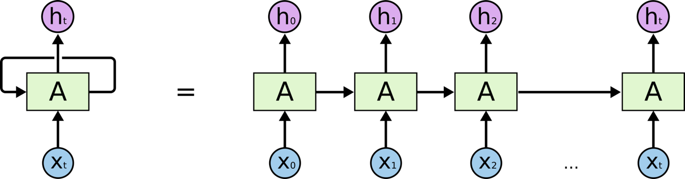
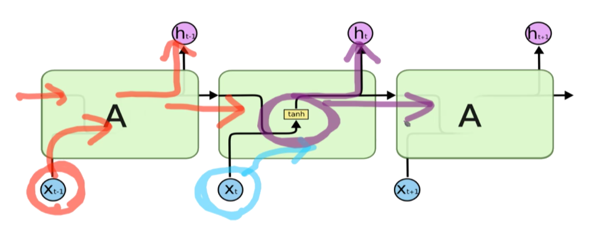
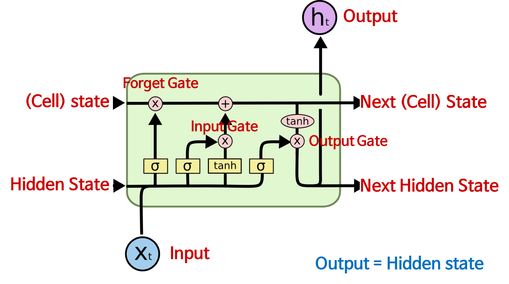

# Recurrent Neural Network(RNN): LSTM

- ```LSTM```은 Long Short Term Memory의 약자로 최근 RNN에선 Standard로 사용되고 있음
- Recurrent : 이전에서 어떤 정보가 추가적으로 왔음
- 마치 메모리가 하나 있는 것처럼 이전에 까지 온 데이터를 취합한 메모리 + 현재 입력을 같이 고려하는 구조



### Long-Term Dependencies
- 시간적으로 서로 correlation이 있는 데이터를 처리하기 위해 사용
- ```The clouds are in the sky``` : are in the만 보면 sky를 유추할 수 없음. clouds까지 봐야 유추할 수 있음


### Longer-Term Dependencies
- 이전 문장만으로 글을 이해하는 것이 아닌 전체 문장까지 이해해야 현재 내용을 올바르게 이해할 수 있는 것처럼, 데이터도 동일

### LSTM : Long Short Term Memory
- 가장 기본적인 바닐라 RNN



#### 전체적 Architecture
- 공장의 컨테이너 벨트처럼 생김
- t번째 시간의 input(단어)
- 2개의 State
	- Cell State : 절대로 밖으로 빠져나가지 않는 흘러가는 State
	- Hidden State : 이전 출력
- 3개의 Gate
	- Forget Gate 
	- Input Gate
	- Output Gate




### Forget Gate
- 입출력