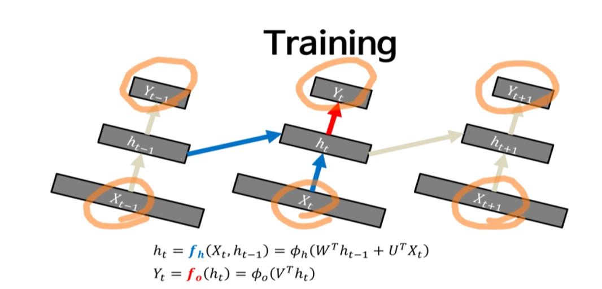
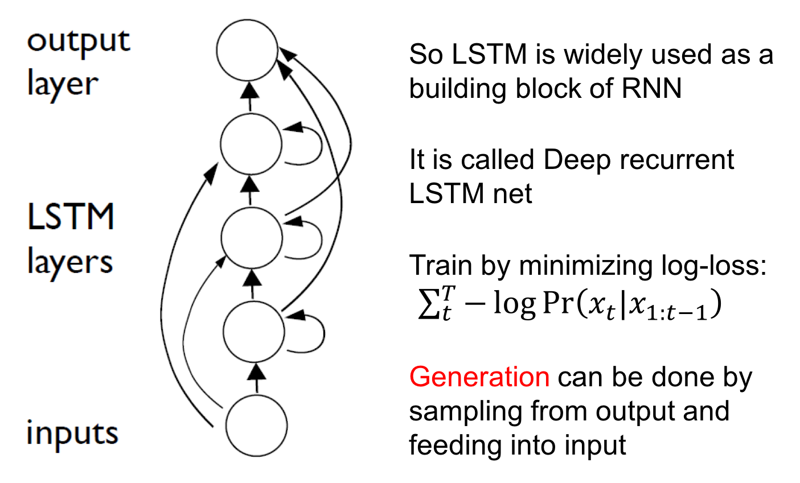
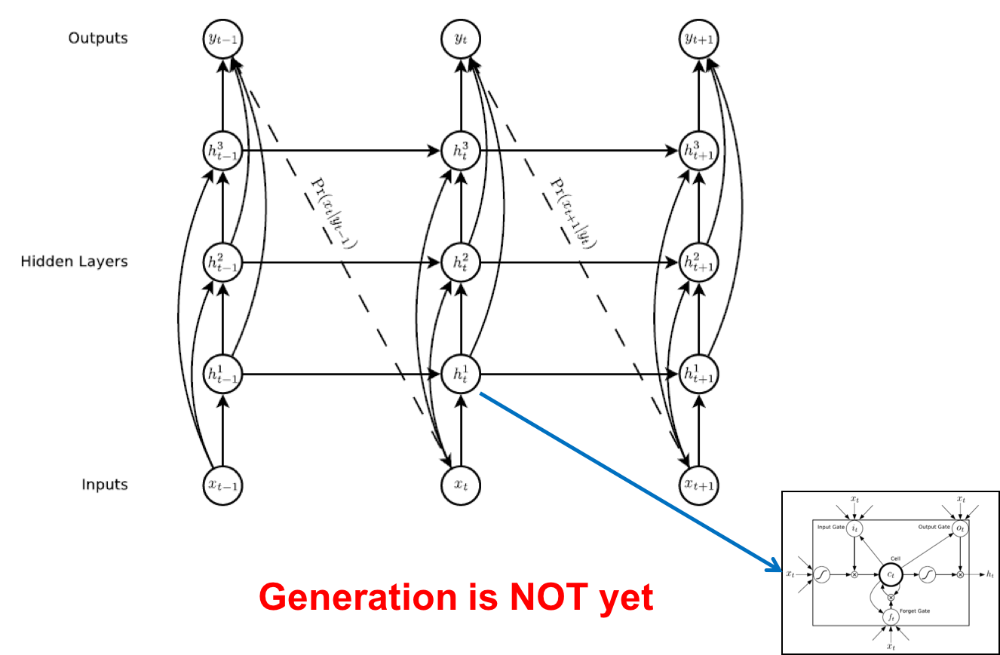
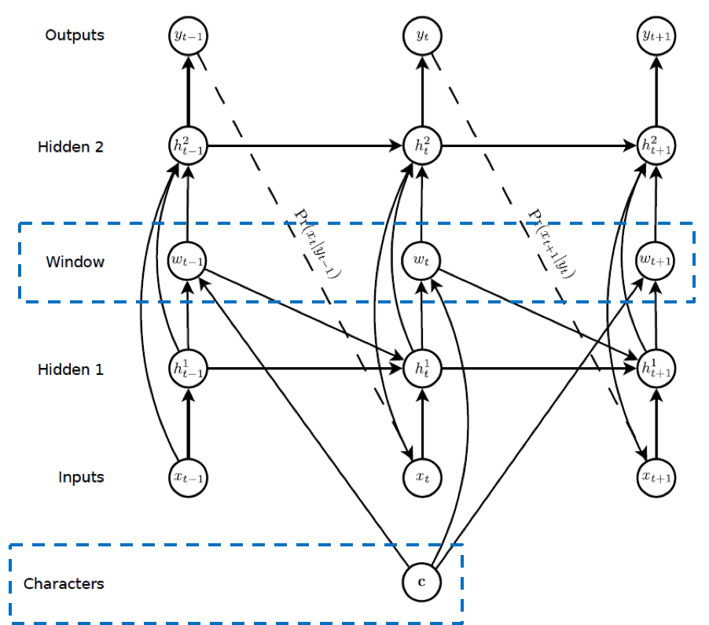

# RNN을 이용해 손글씨를 만드는 Handwriting generation

- 기본적인 RNN에 대한 내용과 Sequence Generation 논문에 대해 알아볼 예정입니다

### Depp Recurrent Neural Network
- 전에 말한 RNN과 구조는 동일하되 레이어가 더 많아지는 것

### stacker Recurrent Neural network
- 한겹 더 올리는 것
- 아래의 cell state가 조금 더 short term dependency를 잡고, 그 위의 cell state가 long term dependency를 잡음

### Training
- neural net을 학습시킨다는 것은 X_t, Y_t 값들이 train data로 주어짐

- 시간순으로 풀어버린 것을 길게 입력, 출력으로 봄
- shared network(파라미터를 쉐어링) -> h_t

- 어떤 h_4를 구한다고 할 경우 h1,h2,h3를 다 구해야 함
- 동일한 파라미터가 시간순만큼 반복 - 이게 1보다 크다면 explode! 0보다 작다면 vanish(vanishing, exploding gradient)
- 따라서 학습시키기 정말 어려움

- Unfolding in Time
	- 시간순으로 풀어서 긴 input과 긴 output을 처리

	
### Gated Recurrent Unit (GRU)
- LSTM에 비해 더 간단한 구조(Gate가 1개 빠짐)
- 더 적은수의 파라미터로 학습할 수 있음

### LSTM
- 각각의 게이트는 sigmoid
- update, output 끌어내는 경우는 tanh

## Generating Sequences with recurrent Neural network
- repeatedly predict what will happen next

### The Role of Memory
- 미래를 예측하기 위해 과거를 기억해야 함
- 과거를 잘 기억
- 기본적 RNN은 동일한 구조가 계속 반복되기 때문에 위 내용을 잘 못함
- 따라서 LSTM을 사용

### Basic Architecture

- generation은 out과 input의 샘플링을 통해 수행

- Prediction Network
	
	
	
	- 어떤 입력이 주어졌을 때 다음번 입력에 대한 확률 분포를 찾는 것
	- 아직 generation은 아님
	- 적절한 Pr(x_t+1|y_t)를 정하는 것이 중요

- Text Prediction
	- k개의 글자 중 하나를 고름! one hot벡터에서 softmax를 취해 확률을 구함
- Handwriting Prediction
	- mixture density network. continuous하기 때문에 discrete한 값들을 연속으로 표현할 수 없음
	- input은 pen offest과 end of stroke(중간에 멈출지)
	- output의 확률 분포가 가우시안 mixture distribution이 되야함

### Experiment	
- 캐릭터마다 다른 handwriting을 위해 실험
- 캐릭터의 conditionling 데이터를 추가해야함
- 캐릭터의 갯수는 3개일수 있지만 그것을 쓰기 위한 stroke는 30개일 수 있음(숫자가 차이가 나기 때문에 맵핑을 찾으면 안됨)
- 따라서 soft window(attention) 모델을 추가함

- 진행될수록 어려워서 공부하고 다시 학습하는거로-